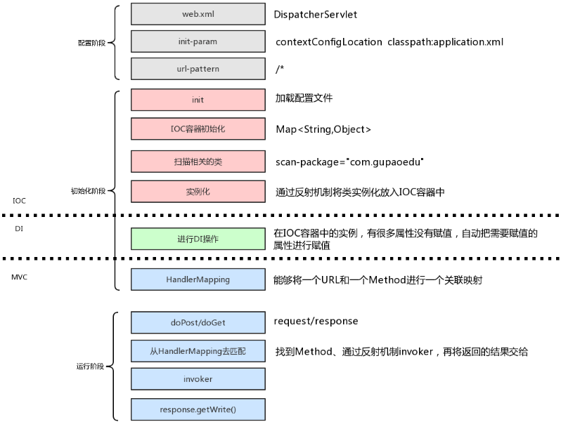

# 自己实现简单的Spring MVC
2018年12月10日 00:11:34

## 写在前面
去年毕业，进入公司开始接触并学习 JAVA WEB ，用的就是 Spring MVC 框架。到现在一年了，用是用得多了，可是说实话，问到什么 IOC 、 DI ，感觉自己也说不上来是啥
借这个机会，好好学习一下 Spring MVC 的这些基础核心的思想。也包括各种反射机制的使用
没什么很牛逼的地方，只是简单地实现了基础的部分。
借用网上的一个图

大概就是这样的思路了

## 环境
IntelliJ IDEA 2018.3.1 (Ultimate Edition)
JDK: 1.8.0_192
Build #IU-183.4588.61, built on December 4, 2018
Licensed to Rover12421 / Rover12421
Subscription is active until January 1, 2100
JRE: 1.8.0_152-release-1343-b16 amd64
JVM: OpenJDK 64-Bit Server VM by JetBrains s.r.o
Windows 10 10.0

## 开始
首先，展示一下这是项目结构

包含了 controller 、 Annotation 、 DispatcherServlet 、 Service 等等
### 创建项目
创建一个 Maven 项目， pom.xml 引入 javax.servlet-api 这个包， Maven 大法好，方便快捷。
``` XML
<?xml version="1.0" encoding="UTF-8"?>
<project xmlns="http://maven.apache.org/POM/4.0.0"
         xmlns:xsi="http://www.w3.org/2001/XMLSchema-instance"
         xsi:schemaLocation="http://maven.apache.org/POM/4.0.0 http://maven.apache.org/xsd/maven-4.0.0.xsd">
    <modelVersion>4.0.0</modelVersion>

    <groupId>com.demo</groupId>
    <artifactId>my-spring</artifactId>
    <version>1.0-SNAPSHOT</version>

    <dependencies>

        <!-- https://mvnrepository.com/artifact/javax.servlet/javax.servlet-api -->
        <dependency>
            <groupId>javax.servlet</groupId>
            <artifactId>javax.servlet-api</artifactId>
            <version>4.0.1</version>
            <scope>provided</scope>
        </dependency>

    </dependencies>
</project>
```
### 配置阶段
核心的入口配置， web.xml ,配置为自己实现的 servlet 。 web.xml 相关写法和内容基本和原生 spring 一样
```XML
<?xml version="1.0" encoding="UTF-8"?>
<web-app xmlns="http://xmlns.jcp.org/xml/ns/javaee"
         xmlns:xsi="http://www.w3.org/2001/XMLSchema-instance"
         xsi:schemaLocation="http://xmlns.jcp.org/xml/ns/javaee http://xmlns.jcp.org/xml/ns/javaee/web-app_4_0.xsd"
         version="4.0">

    <display-name>Wang Web Application</display-name>

    <servlet>
        <servlet-name>wang-mvc</servlet-name>
        <servlet-class>com.demo.mvcframework.servlet.DispatchServlet</servlet-class>
        <init-param>
            <param-name>contextConfigLocation</param-name>
            <param-value>application.properties</param-value>
        </init-param>
        <load-on-startup>1</load-on-startup>
    </servlet>

    <servlet-mapping>
        <servlet-name>wang-mvc</servlet-name>
        <url-pattern>/*</url-pattern>
    </servlet-mapping>

</web-app>
```
spring 框架使用的是 application.xml ，可以看到上面的 web.xml 我为了简便用 properties 代替 xml 吧，本来想用 yml 的，但是要引入其他的包就算了。
properties 里面的内容只有要被扫描到的包
```PROPERTIES
scanPackage=com.demo
```
配置阶段到此结束

### 初始化阶段
因为不依赖任何spring的东西，所以要自己实现注解，
类上的注解 `@Controller` ， `@Service`
参数上的注解 `@RequestParam`
成员变量上的注解 `@Autowired`
类和方法上的注解 `@RequestMapping`
注解都很简单，没什么内容，用 `@Target` 设置好作用域， `@Retention` 设置好作用时间， `@Documented` 将注解加入生成的 javadoc 文档，加不加看个人喜欢，我是加了。
所以这里就不贴代码了。可以在我的<a target="_blank" href="https://github.com/710241969/my-spring/tree/master/src/main/java/com/demo/mvcframework/annotation">源码</a>中查看哦，其他的 Controller 、 Service 也都是简单的示例，也不贴代码了。

最核心最关键的路由请求分发器开始啦
创建自己的 Dispathservlet ，继承自 HttpServlet
在这里，只需要重写 `doGet` `doPost` `init` 三个方法就足够了，具体的都写到注释上了
我们先看看成员变量，一共就这么些，具体每一个的作用后面详细说说
```JAVA
    private Properties contextConfig = new Properties(); // 读取的配置内容
    private List<String> classNameList = new ArrayList<>(); // 扫描到的类名列表
    private Map<String, Object> ioc = new HashMap<>(); // 传说中的 IOC 容器其实就是个 Map， ioc.put(beanName, instance)
    private List<Handler> handlerList = new ArrayList<>(); // 自己实现的 Handler 对象列表，存放处理请求的 Handler 信息
```
重写 init 方法
```JAVA
    /**
     * 显式地实现 init 方法，当 Servlet 容器启动时，会调用 DispatcherServlet 的init()方法
     *
     * @param config
     * @throws ServletException
     */
    @Override
    public void init(ServletConfig config) throws ServletException {
        // 加载配置文件，从 doLoadConfig 方法中，我们获取配置的内容
        // 其中 ServletConfig 的 getInitParameter 方法可以拿到 web.xml 中这个 servlet 的指定属性的值
        // 所以这里拿 contextConfigLocation 这个属性的值，结果是 application.properties
        doLoadConfig(config.getInitParameter("contextConfigLocation"));

        // 扫描指定包内的类
        // contextConfig 在上面的 doLoadConfig 方法中得到初始化
        doScan(contextConfig.getProperty("scanPackage"));

        // 构造 IOC 容器。初始化相关联的类，实例化并放入 IOC 容器中
        doInstance();

        // 自动化依赖注入
        doAutowired();

        // 初始化 HandlerMapping
        initHandlerMapping();
    }
```
一个一个来，首先是 doLoadConfig 加载配置
```JAVA
    /**
     * 从能够读取到 web.xml 配置文件中的信息，读取到 Properties 对象中
     *
     * @param contextConfigLocation
     */
    private void doLoadConfig(String contextConfigLocation) {
        // 从传入的配置文件名，读取文件中所有配置内容
        InputStream inputStream = this.getClass().getClassLoader().getResourceAsStream(contextConfigLocation);
        try {
            contextConfig.load(inputStream); // 赋值给 contextConfig
        } catch (IOException e) {
            e.printStackTrace();
        } finally {
            if (null != inputStream) {
                try {
                    inputStream.close();
                } catch (IOException e) {
                    e.printStackTrace();
                }
            }
        }
    }
```
doScan 扫描配置中指定的包，加入到 classNameList 中
```JAVA
    /**
     * 扫描指定包下的全部 class ,为 classNameList 加入数据
     *
     * @param scanPackage
     */
    private void doScan(String scanPackage) {
        // 拿到包路径
        URL url = this.getClass().getClassLoader().getResource("/" + scanPackage.replace(".", "/"));
        File classDir = new File(url.getFile());
        // 如果指定扫描的不是包而是文件，直接加入列表返回，或者抛出异常也行
        if (classDir.isFile()) {
            classNameList.add(scanPackage);
            return;
        }
        // 因为包下面可能还有很多包，所以需要不断遍历
        // 方法之一，递归遍历整个包，代码被我注释掉了，但是我不喜欢递归。能用循环的我都用循环
/*        for (File item : classDir.listFiles()) {
            if (item.isDirectory()) {
                doScan(scanPackage + "." + item.getName());
            } else {
                String className = (scanPackage + "." + item.getName()).replace(".class", "");
                classNameList.add(className);
            }
        }*/

        // 使用循环代替遍历，就是优先搜索，这里是宽度优先搜索
        List<String> pathList = new ArrayList<>();
        List<File> dirList = new ArrayList<>();
        pathList.add(scanPackage);
        dirList.add(classDir);
        while (!dirList.isEmpty()) {
            File dirItem = dirList.remove(0);
            String pathItem = pathList.remove(0);
            for (File fileItem : dirItem.listFiles()) {
                if (fileItem.isDirectory()) {
                    dirList.add(fileItem);
                    pathList.add(pathItem + "." + fileItem.getName());
                    continue;
                }
                String className = (pathItem + "." + fileItem.getName()).replace(".class", "");
                classNameList.add(className);
            }
        }
    }
```
doInstance 遍历上一步得到的类列表，需要的类进行实例化，然后加入到 IOC 容器中
```JAVA
    /**
     * 实例化相关的类，并放入 IOC 容器中
     * 只有加了 Controller 和 Service 注解的类才需要实例化，应当以单例模式实例化
     * IOC 容器的 key 默认是类名首字母小写
     */
    private void doInstance() {
        // 判断在上一步中有没有扫描到类，没有直接退出
        if (classNameList.isEmpty()) {
            return;
        }
        try {
            for (String item : classNameList) {
                // 拿到指定类名的class对象，进行反射，只有加了 Controller 和 Service 注解的类才需要处理
                Class<?> clazz = Class.forName(item);
                // isAnnotationPresent 方法判断该类是否存在指定注解
                if (clazz.isAnnotationPresent(Controller.class)) {
                    // 获取底层类名，转换为首字母小写
                    // 注意 getName 和 getSimpleName 方法的区别
                    String key = StringUtil.lowerCaseFirst(clazz.getSimpleName()); // StringUtil 是个自己写的简单工具类而已
                    // 通过反射 newInstance 方法实例化此类，放入 IOC 容器中
                    ioc.put(key, clazz.newInstance());
                } else if (clazz.isAnnotationPresent(Service.class)) {
                    Service service = clazz.getAnnotation(Service.class);
                    Object instance = clazz.newInstance();
                    // Service 可能使用指定的名字，所以比上面多一点处理
                    String beanName = service.value();
                    if ("".equals(beanName.trim())) {
                        // 没有指定名字则使用默认的类名首字母小写
                        beanName = StringUtil.lowerCaseFirst(clazz.getSimpleName());
                    }
                    ioc.put(beanName, instance);
                    // 我不用接口的方式，所以就不对接口处理
/*                    Class<?>[] interfaces = clazz.getInterfaces(); // 获取该类实现的所有接口
                    for (Class<?> i : interfaces) {
                        ioc.put(i.getName(), clazz.newInstance());
                    }*/
                }
            }
        } catch (Exception e) {
            e.printStackTrace();
        }
    }
```
doAutowired 进行依赖注入
```JAVA
    /**
     * 遍历 IOC 容器中的对象，对加了 Autowired 注解的成员变量进行赋值
     */
    private void doAutowired() {
        if (ioc.isEmpty()) {
            return;
        }
        // 依赖注入，给 ioc 容器里加了 Autowired 注解的字段赋值
        for (Map.Entry<String, Object> entry : ioc.entrySet()) {
            // getDeclaredFields 方法获取类声明的所有变量，但不包括父类的变量
            // 注意区分类似的 getFields 方法获取类的所有 public 变量，包括父类中的
            Field[] fieldArray = entry.getValue().getClass().getDeclaredFields();
            // 遍历每个字段，对加了 Autowired 注解的进行处理
            for (Field field : fieldArray) {
                if (!field.isAnnotationPresent(Autowired.class)) {
                    continue;
                }
                Autowired autowired = field.getAnnotation(Autowired.class);
                // 判断注解上是否使用了自定义的名字
                String beanName = autowired.value().trim(); // 其实就是OC 容器的 key
                if ("".equals(beanName)) {
                    // 没有使用自定义名字，默认使用类名，首字母小写。
                    beanName = StringUtil.lowerCaseFirst(field.getType().getSimpleName());
                }
                field.setAccessible(true); // 通过反射，获取私有属性访问权限，保证下面能够赋值
                try {
                    // 通过 set 给字段赋值。方法的第一个参数应传入需要修改这个字段的对象，第二个参数传入要赋予的值
                    // 所以第一个参数是当前遍历到的这个对象，第二个参数是 IOC 容器中 key 为这个名字的实例
                    field.set(entry.getValue(), ioc.get(beanName)); // 给注解了 Autowired 的类的字段，赋值为该字段类型的实例
                } catch (Exception e) {
                    e.printStackTrace();
                    // 异常继续处理，事实上应该抛出
                    continue;
                }

            }
        }
    }
```
handlerMapping 初始化路由和方法映射
```JAVA
    /**
     * 初始化 handlerMapping
     * 其实就是将 url 和处理整个 url 的方法映射起来
     */
    private void initHandlerMapping() {
        if (ioc.isEmpty()) {
            return;
        }
        // 遍历 IOC 容器
        for (Map.Entry<String, Object> entry : ioc.entrySet()) {
            // 只针对 Controller 进行处理，否则都略过
            Class<?> clazz = entry.getValue().getClass();
            if (!clazz.isAnnotationPresent(Controller.class)) {
                continue;
            }
            String baseUrl = "";
            if (clazz.isAnnotationPresent(RequestMapping.class)) {
                // 首先如果类上使用了 RequestMapping 注解，那么 URL 从类上开始
                RequestMapping requestMapping = clazz.getAnnotation(RequestMapping.class);
                baseUrl = requestMapping.path();
            }
            // 通过 getMethods 方法获取该类的方法
            Method[] methodArray = clazz.getMethods();
            // 遍历方法，对加了 RequestMapping 的方法进行处理
            for (Method method : methodArray) {
                if (!method.isAnnotationPresent(RequestMapping.class)) {
                    continue;
                }
                // 获取这个方法的 RequestMapping 注解，拿到注解的属性值
                RequestMapping requestMapping = method.getAnnotation(RequestMapping.class);
                String regex = (baseUrl + requestMapping.path()).replaceAll("/+", "/");
                Pattern pattern = Pattern.compile(regex);
                // Handler 是自定义的内嵌类，带有 URL 地址、类名和对应的 Controller 方法等等。
                // handlerList 加入这个方法对应的 Handler
                handlerList.add(new Handler(pattern, entry.getValue(), method));
            }
        }
    }
```
这是自己定义的那个内嵌类 Handler
```JAVA
    private class Handler {
        private Pattern pattern; // url 正则匹配规则。
        private Object controller; // 方法对应的实例
        private Method method; // 方法
        private Map<String, Integer> paramIndexMap; // 参数对应的顺序映射 paramIndexMap<变量名，变量在所属方法中变量列表的下标>

        private Handler(Pattern pattern, Object controller, Method method) {
            this.pattern = pattern;
            this.controller = controller;
            this.method = method;
            paramIndexMap = new HashMap<>();
            putParamIndexMapping(method);
        }

        /**
         * 处理加了 RequestParam 注解的参数
         *
         * @param method
         */
        private void putParamIndexMapping(Method method) {
            // 获取加了 annotation 注解的参数
            Annotation[][] parameterAnnotationArray = method.getParameterAnnotations(); // 结果是一个二维数组，因为参数前可以添加多个注解
            // 遍历每个参数
            for (int i = 0, len = parameterAnnotationArray.length; i < len; i++) {
                // 遍历参数的每个注解
                for (Annotation annotation : parameterAnnotationArray[i]) {
                    // 找出注解了 RequestParam 的参数
                    if (annotation instanceof RequestParam) {
                        String paramName = ((RequestParam) annotation).value();
                        if (!"".equals(paramName)) {
                            paramIndexMap.put(paramName, i);
                        }
                    }
                }
            }
            // 特殊处理 HttpServletRequest 和 HttpServletResponse 两个变量
            // getParameterTypes 方法获取这个方法传入的参数类型列表
            Class<?>[] paramTypeArray = method.getParameterTypes();
            for (int i = 0, len = paramTypeArray.length; i < len; i++) {
                Class<?> type = paramTypeArray[i];
                if (type == HttpServletRequest.class || type == HttpServletResponse.class) {
                    paramIndexMap.put(type.getName(), i);
                }
            }
        }
    }
```
最后，开始响应请求啦
重写 doGet
```JAVA
    @Override
    protected void doGet(HttpServletRequest req, HttpServletResponse resp) throws ServletException, IOException {
        //偷个懒
        this.doPost(req, resp);
    }
```
所以把重点都放到 doPost上
```JAVA
    @Override
    protected void doPost(HttpServletRequest req, HttpServletResponse resp) throws ServletException, IOException {
        try {
            if (handlerList.isEmpty()) {
                // 没有任何处理，则返回 404
                resp.getWriter().write("404 Not Found");
                return;
            }

            // handlerList 中找到相应的 handler
            String url = req.getRequestURI();
            String contextPath = req.getContextPath();
            url = url.replace(contextPath, "").replaceAll("/+", "/");
            Handler handler = null;
            // 遍历 handlerList 找出对应该请求 uri 的 hadler
            for (Handler handlerItem : handlerList) {
                Matcher matcher = handlerItem.pattern.matcher(url);
                if (!matcher.matches()) {
                    continue;
                }
                handler = handlerItem;
            }
            if (null == handler) {
                resp.getWriter().write("404 Not Found");
                return;
            }

            Class<?>[] paramTypeArray = handler.method.getParameterTypes();
            Object[] paramValueArray = new Object[paramTypeArray.length];
            Map<String, String[]> paramMap = req.getParameterMap(); // 请求携带的参数，key 是参数名，value 是参数的值字符串数组
            // 遍历请求中携带的参数
            for (Map.Entry<String, String[]> param : paramMap.entrySet()) {
                String value = Arrays.toString(param.getValue()).replaceAll("\\[|\\]", ""); // 将 value 的字符串中的两个中括号去掉 [] ，正则中使用 | 替换多个字符
                if (!handler.paramIndexMap.containsKey(param.getKey())) {
                    continue;
                }
                int index = handler.paramIndexMap.get(param.getKey());
                paramValueArray[index] = value;
            }
            // 请求中传入的参数是没有 HttpServletRequest 和 HttpServletResponse 的，我们必须对这两个进行处理
            int reqIndex = handler.paramIndexMap.get(HttpServletRequest.class.getName());
            paramValueArray[reqIndex] = req;
            int resIndex = handler.paramIndexMap.get(HttpServletResponse.class.getName());
            paramValueArray[resIndex] = resp;
            
            handler.method.invoke(handler.controller, paramValueArray); // 最后通过反射调用方法
        } catch (Exception e) {
            e.printStackTrace();
            resp.getWriter().write("500 Server Internal Error");
            return;
        }
    }
```

搞定，最后加入一个简单的 controller 来测试测试相应功能
```JAVA
@Controller
@RequestMapping(path = "/hello")
public class HelloController {
    @Autowired
    private HelloService helloService;

    @RequestMapping(path = "/world")
    public void helloWorld(HttpServletRequest request, HttpServletResponse response, @RequestParam(value = "name") String name) {
        try {
            response.getWriter().write("Hello," + name);
        } catch (IOException e) {
            e.printStackTrace();
        }
    }

    @RequestMapping(path = "/age")
    public void getAge(HttpServletRequest request, HttpServletResponse response) {
        try {
            response.getWriter().write("Age is " + helloService.getAge());
        } catch (IOException e) {
            e.printStackTrace();
        }
    }
}
```
部署好 tomcat 等容器之后之后，跑一下
经过一系列 DEBUG 之后，终于成功了。。


当然，上面这些其实都是简单核心思想的示例，真实的 spring mvc 可比这个复杂得多了

## 代码地址
完整项目代码已经放到 github 上
https://github.com/710241969/my-spring

## 参考
http://bbs.gupaoedu.com/forum.php?mod=viewthread&tid=572&highlight=手写spring