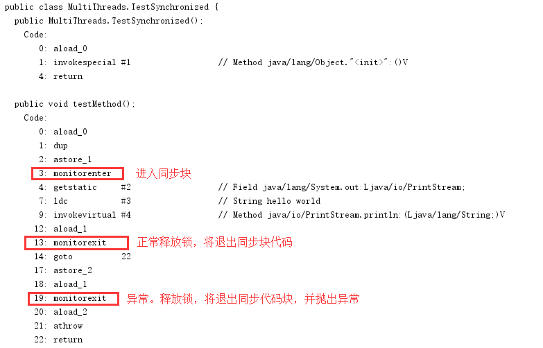
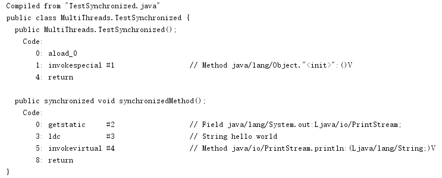

# Synchronized 关键字

## 作用
synchronized 关键字保证在多线程环境中，只有一个线程可以执行某个方法或者某个代码块，同时还有另一个作用就是保证可见性（一个线程操作的共享数据变化，可以被其他线程看到，也就是 volatile 的保证可见性功能）

## 三种使用方式
synchronized 关键字的使用方式总共就以下三种：
1. 修饰代码块
2. 修饰静态方法（类方法）
3. 修饰实例方法

就不多说了。相信大家都已经有所了解

## 原理
首先写简单的一段同步代码块方法
```JAVA
public class TestSynchronized {

    public void testMethod() {
        synchronized (this) {
            System.out.println("hello world");
        }
    }
}
```
先编译出 .class 文件，然后对 .class 文件进行 javap -c 查看反编译字节码

synchronized 无论是同步方法还是同步代码块， JVM 实现语义都是由 monitor 来支持的
JAVA 虚拟机的指令集中有 monitorenter 和 monitorexit 两个指令来支持 synchronized 关键字的语义
**方法的同步是隐式的，不需要通过字节码来控制，它的实现在方法调用和返回操作之中**
所以对于代码
```JAVA
    public synchronized void synchronizedMethod() {
        System.out.println("hello world");
    }
```
我们可以看到它的反编译结果是

并没有看到 monitorenter 和 monitorexit
> 虚拟机可以从方法常量池中的方法表结构(method_info structure)中的 ACC_SYNCHRONIZED 访问标志区分一个方法是否是同步方法。当调用方法时，调用指令将会检查方法的 ACC_SYNCHRONIZED 访问标志是否设置了，如果设置了，执行线程将先持有同步锁，然后执行方法，最后在方法完成（无论是正常完成还是非正常完成）时释放同步锁。在方法执行期间，执行线程持有了同步锁，其他任何线程都无法再获得同一个锁。

java对象头和 monitor

## JVM 对 synchronized 的优化
偏向锁

轻量级锁

自旋锁 Adaptive Spinning

消除锁 Lock Elimination

重量级锁

