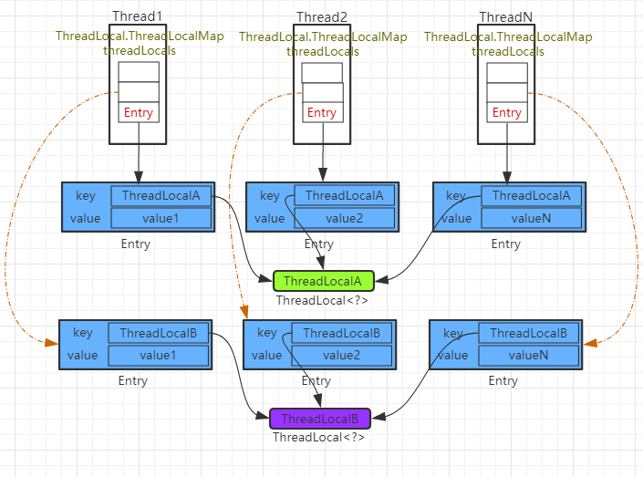
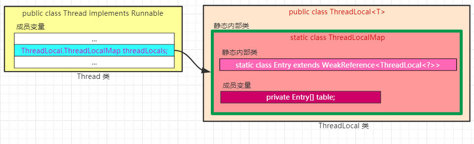

```Java
    /* ThreadLocal values pertaining to this thread. This map is maintained
     * by the ThreadLocal class. */
    ThreadLocal.ThreadLocalMap threadLocals = null;
```

```Java
public class ThreadLocal<T> {
    ...
}
```
```Java
    /**
     * ThreadLocalMap is a customized hash map suitable only for
     * maintaining thread local values. No operations are exported
     * outside of the ThreadLocal class. The class is package private to
     * allow declaration of fields in class Thread.  To help deal with
     * very large and long-lived usages, the hash table entries use
     * WeakReferences for keys. However, since reference queues are not
     * used, stale entries are guaranteed to be removed only when
     * the table starts running out of space.
     */
    static class ThreadLocalMap {
        ...
    }
```
```Java
        /**
         * The entries in this hash map extend WeakReference, using
         * its main ref field as the key (which is always a
         * ThreadLocal object).  Note that null keys (i.e. entry.get()
         * == null) mean that the key is no longer referenced, so the
         * entry can be expunged from table.  Such entries are referred to
         * as "stale entries" in the code that follows.
         */
        static class Entry extends WeakReference<ThreadLocal<?>> {
            /** The value associated with this ThreadLocal. */
            Object value;

            Entry(ThreadLocal<?> k, Object v) {
                super(k);
                value = v;
            }
        }
```






Hash冲突
ThreadLocalMap是ThreadLocal的内部类，没有实现Map接口，用独立的方式实现了Map的功能，其内部的Entry也独立实现。
在ThreadLocalMap中，也是用Entry来保存K-V结构数据的。但是Entry中key只能是ThreadLocal对象，这点被Entry的构造方法已经限定死了
和HashMap的最大的不同在于，ThreadLocalMap结构非常简单，没有next引用，也就是说ThreadLocalMap中解决Hash冲突的方式并非链表的方式，而是采用线性探测的方式，所谓线性探测，就是根据初始key的hashcode值确定元素在table数组中的位置，如果发现这个位置上已经有其他key值的元素被占用，则利用固定的算法寻找一定步长的下个位置，依次判断，直至找到能够存放的位置。
ThreadLocalMap解决Hash冲突的方式就是简单的步长加1或减1，寻找下一个相邻的位置
显然ThreadLocalMap采用线性探测的方式解决Hash冲突的效率很低，如果有大量不同的ThreadLocal对象放入map中时发送冲突，或者发生二次冲突，则效率很低。
所以这里引出的良好建议是：每个线程只存一个变量，这样的话所有的线程存放到map中的Key都是相同的ThreadLocal，如果一个线程要保存多个变量，就需要创建多个ThreadLocal，多个ThreadLocal放入Map中时会极大的增加Hash冲突的可能


内存泄露
由于ThreadLocalMap的key是弱引用，而Value是强引用。这就导致了一个问题，ThreadLocal在没有外部对象强引用时，发生GC时弱引用Key会被回收，而Value不会回收，如果创建ThreadLocal的线程一直持续运行，那么这个Entry对象中的value就有可能一直得不到回收，发生内存泄露。
既然Key是弱引用，那么我们要做的事，就是在调用ThreadLocal的get()、set()方法时完成后再调用remove方法，将Entry节点和Map的引用关系移除，这样整个Entry对象在GC Roots分析后就变成不可达了，下次GC的时候就可以被回收。
如果使用ThreadLocal的set方法之后，没有显示的调用remove方法，就有可能发生内存泄露，所以养成良好的编程习惯十分重要，使用完ThreadLocal之后，记得调用remove方法

脏数据
线程池复用会产生脏数据。由于线程池会重用 Thread 对象 ，那么与 Thread 绑定的类的静态属性 ThreadLocal 变量也会被重用。如果在实现的线程 run() 方法体中不显式地调用 remove() 清理与线程相关的 TbreadLocal 信息，那么倘若下一个线程不调用 set() 设置初始值，就可能 get() 到重用的线程信息，包括 ThreadLocal 所关联的线程对象的 value 值

```Java
try {
    // 其它业务逻辑
} finally {
    threadLocal.remove();
}
```

应用场景
使用ThreadLocal的典型场景正如上面的数据库连接管理，线程会话管理等场景，只适用于独立变量副本的情况，如果变量为全局共享的，则不适用在高并发下使用

总结
每个ThreadLocal只能保存一个变量副本，如果想要上线一个线程能够保存多个副本以上，就需要创建多个ThreadLocal。

ThreadLocal内部的ThreadLocalMap键为弱引用，会有内存泄漏的风险

适用于无状态，副本变量独立后不影响业务逻辑的高并发场景。如果如果业务逻辑强依赖于副本变量，则不适合用ThreadLocal解决，需要另寻解决方案

这种存储结构的好处：

1、线程死去的时候，线程共享变量ThreadLocalMap则销毁。

2、ThreadLocalMap<ThreadLocal,Object>键值对数量为ThreadLocal的数量，一般来说ThreadLocal数量很少，相比在ThreadLocal中用Map<Thread, Object>键值对存储线程共享变量（Thread数量一般来说比ThreadLocal数量多），性能提高很多。