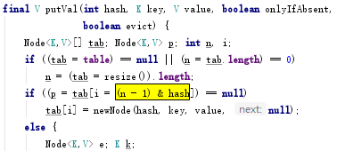
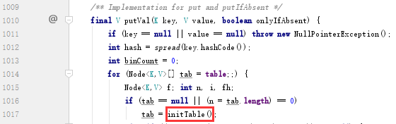
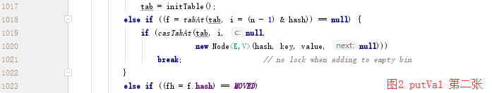

基于 jdk1.8

必须围绕线程安全，线程安全，线程安全！！！每一个操作、数据都必须考虑这个问题

构造方法
首先构造函数方面，一共有下面这几个

除去最后第 5 个之外，其余都只是对类的成员变量进行赋值操作，而并没有真正去初始化存放数据的节点数组。这样能够做到 `懒汉模式` ，能够延时初始化，减少使用的空间。
试想一下，如果初始化了一个 ConcurrentHashMap 就分配好了各个内存并初始化好了数组，而到程序结束都没有使用过，岂不是浪费了很多空间？
那么什么时候进行数组初始化呢？
数组的初始化是在第一次进行 put 操作的时候，真正初始化的对象应该是个结点数组，我们通过源码可以看到成员遍历是 table
```JAVA
    /**
     * The array of bins. Lazily initialized upon first insertion.
     * Size is always a power of two. Accessed directly by iterators.
     */
    transient volatile Node<K,V>[] table;
```
因为要保证线程安全，基本上所有成员变量，都被 `volatile` 关键字修饰了
这里保证数组在多线程中的内存可见性，那是不是就万无一失了呢？不是的，原因下面会说到

put操作
简单贴一下代码
```JAVA
    /**
     * Maps the specified key to the specified value in this table.
     * Neither the key nor the value can be null.
     *
     * <p>The value can be retrieved by calling the {@code get} method
     * with a key that is equal to the original key.
     *
     * @param key key with which the specified value is to be associated
     * @param value value to be associated with the specified key
     * @return the previous value associated with {@code key}, or
     *         {@code null} if there was no mapping for {@code key}
     * @throws NullPointerException if the specified key or value is null
     */
    public V put(K key, V value) {
        return putVal(key, value, false);
    }
```
可以看到 put 操作调用了 putVal 方法。还记得 HashMap 吗，一样。
但是这里要特别注意， HashMap 允许 null 作为 key ，也可以将 null 作为 value ，但是 ConcurrentHashMap 不行，为什么呢？？？
现在还不知道，顺着代码往下看吧，一定能找到答案
一段一段来

先看到这里，如果 ConcurrentHashMap 的列表未被初始化过，则通过 `initTable()` 方法进行初始化，和上面提到的延时初始化是一致的。
我们先想一想 ConcurrentHashMap 是为了解决多线程问题，初始化也当然需要考虑线程安全问题，怎么做到呢？加锁，加锁当然可以，通过 synchronized 或者 lock 进行各种同步策略都可以实现，可是，效率呢？这样的开销太大了，更好的解决方案，有没有想到 CAS ？
下面我们 initTable 方法实现，代码比较简短，直接贴出来
```JAVA
    /**
     * Initializes table, using the size recorded in sizeCtl.
     */
    private final Node<K,V>[] initTable() {
        Node<K,V>[] tab; int sc;
        while ((tab = table) == null || tab.length == 0) {
            if ((sc = sizeCtl) < 0)
                Thread.yield(); // lost initialization race; just spin
            else if (U.compareAndSwapInt(this, SIZECTL, sc, -1)) {
                try {
                    if ((tab = table) == null || tab.length == 0) {
                        int n = (sc > 0) ? sc : DEFAULT_CAPACITY;
                        @SuppressWarnings("unchecked")
                        Node<K,V>[] nt = (Node<K,V>[])new Node<?,?>[n];
                        table = tab = nt;
                        sc = n - (n >>> 2);
                    }
                } finally {
                    sizeCtl = sc;
                }
                break;
            }
        }
        return tab;
    }
```
上面可以看到 ConcurrentHashMap 初始化，为保证线程安全，通过 cas 的无锁化方式操作来实现初始化
这里出现了一个成员变量 sizeCtl 是啥呢？
```JAVA
    /**
     * Table initialization and resizing control.  When negative, the
     * table is being initialized or resized: -1 for initialization,
     * else -(1 + the number of active resizing threads).  Otherwise,
     * when table is null, holds the initial table size to use upon
     * creation, or 0 for default. After initialization, holds the
     * next element count value upon which to resize the table.
     */
    private transient volatile int sizeCtl;
```
注意用了 `transient` 关键字

继续往下看

要 put 一个节点，那么首先是要计算出当前的 key 应该位于数组的哪个位置，这里可以看到计算的操作是 `(n - 1) & hash`
和 HashMap 是一样的，原因可以参考 HashMap 篇，这里就不多说了
计算到位置之后，要判断当前位置是否已经存在 node 结点，因为存在 hash 碰撞的情况，这时就要往下顺着链表或者红黑树去寻找位置
那么，注意到判断的语句是 `(f = tabAt(tab, i = (n - 1) & hash)) == null`
其中 `tab` 在图一中可以看到是成员变量 `table`
tabAt() 方法就是去获取 table 当前位置下标的结点，判断是否为 null 。那很奇怪哦，为什么获取数组元素不是直接拿下标，而是通过一个方法呢？具体是怎么获取的呢？看一看
```JAVA
    @SuppressWarnings("unchecked")
    static final <K,V> Node<K,V> tabAt(Node<K,V>[] tab, int i) {
        return (Node<K,V>)U.getObjectVolatile(tab, ((long)i << ASHIFT) + ABASE);
    }
```
这里是为了拿内存中的最新值，很奇怪对吧，在文章开头我们已经看到成员变量 table 是被 volatile 修饰的，为什么这里还要这样操作？
这是因为， volatile 只保证了这个数组对象的可见性，仅此而已，而数组里面每个元素是不会受到 volatile 的修饰的，要获取数组某下标元素的最新值，还得通过这种方式去获取，这才是万无一失的方法

put 也是 cas


> The main reason that nulls aren’t allowed in ConcurrentMaps
(ConcurrentHashMaps, ConcurrentSkipListMaps) is that
ambiguities that may be just barely tolerable in non-concurrent
maps can’t be accommodated. The main one is that if
map.get(key) returns null, you can’t detect whether the
key explicitly maps to null vs the key isn’t mapped.
In a non-concurrent map, you can check this via map.contains(key),
but in a concurrent one, the map might have changed between calls.

当ConcurrentMaps使用map.get(key)时返回为null,无法判断key是不存在还是值为空，non-concurrent还可以再调用map.contains(key)检查，但ConcurrentMaps可能再两次调用间已经发生改变


启示：
1. 懒汉模式初始化对象，比较常见的懒汉模式还有单例模式