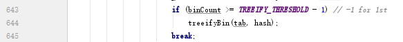
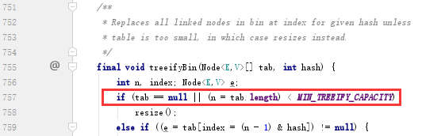

基于 JDK1.8 解读 HashMap 源码

数据结构，数组 + 单向链表/红黑树

先来看看 hashmap 默认初始大小
```JAVA
    /**
     * The default initial capacity - MUST be a power of two.
     */
    static final int DEFAULT_INITIAL_CAPACITY = 1 << 4; // aka 16
```
默认的初始化容量，使用 `1 << 4` 而不是直接写 16 ，为啥这么折腾？一脸懵逼？是有原因的。
就是因为， `MUST be a power of two` 。所以，通过左移运算符，去乘以 2 乘以 2 乘以 2 ······ 若直接写成 16 ，那么也有可能被改成 17 、 18 等等，语义上也不能体现出他必须是 2 的次幂。
那为什么是 2 的次幂？？？是有原因的，跟 key 的 hash 计算其在数组中的位置密切相关。这里很有意思
```JAVA
    /**
     * Computes key.hashCode() and spreads (XORs) higher bits of hash
     * to lower.  Because the table uses power-of-two masking, sets of
     * hashes that vary only in bits above the current mask will
     * always collide. (Among known examples are sets of Float keys
     * holding consecutive whole numbers in small tables.)  So we
     * apply a transform that spreads the impact of higher bits
     * downward. There is a tradeoff between speed, utility, and
     * quality of bit-spreading. Because many common sets of hashes
     * are already reasonably distributed (so don't benefit from
     * spreading), and because we use trees to handle large sets of
     * collisions in bins, we just XOR some shifted bits in the
     * cheapest possible way to reduce systematic lossage, as well as
     * to incorporate impact of the highest bits that would otherwise
     * never be used in index calculations because of table bounds.
     */
    static final int hash(Object key) {
        int h;
        return (key == null) ? 0 : (h = key.hashCode()) ^ (h >>> 16);
    }
```
这是去计算在 hashMap 中这一个 key 的 hash 值。首先通过 hashCode() 方法获得 key 的 hashCode ，然后，将 hashCode 的低 16 位和高 16 位进行异或运算（ `>>>` 是无符号右移，表现为忽略符号位，空位都以0补齐 ），就得到这个 key 的 hash 值了，是个整数哦！那为什么要这么折腾呢？我觉得设计者这样做就是为了更好的进行哈希，让结果能够更加均匀分布。
这就是为什么大小以及扩容得是 2 的次幂？当然不是，光看这个还看不出来好吧。
在进行 put 操作的时候，得把这个 key 的节点放在数组的某个位置吧？比如一开始数组长度是 16 ，那么根据这个 key 的 hashCode 计算得到的下标应当是大于等于 0 ，小于 16 没错吧？那怎么做到？我们所学过的最原始的方法，就是取模了， mod 为 16 ，就是对 16 求余，也就是 %16 ，有点啰嗦了。。。当然， jdk 里面比这个高级，但是也是为了计算得到这么个结果。下面才是原因

```JAVA
(n - 1) & hash
```
这才是计算这个 key 的 node 应该所在的数组的下标，好几个地方用到，上面的截图只是其中一处。
解释下， n 就是当前 hashMap 的长度，比如一开始是 1<<4 就是 16 。我们就用 16 举例。我们知道 16 的二进制就是 10000 ，那么 16 - 1 = 15 ， 15 的二进制是 1111 ，精妙之处就在这里，用 15 与上当前 key 的 hash 值（一个整数），比如
0100010100010101 & 1111 = 0101
那么，这个与操作的结果，就一定是 0<= 下标 <=15 ，刚好在数组长度内，不会越界。我们也知道，使用逻辑运算的效率，是最高的！比我们做乘除法，做求余不知道高到哪里去了。
这里，就可以解释为什么数组的大小要是 2 的次幂
假设我们的 hashMap 长度是 15 的话，根据上面的代码， n=15 ，那 n-1=14 ， 14 的二进制就是 1110 了。
那么！问题来了，那么，在做与运算的时候， 任何 hash 数值与上 1110 ， 结果的第一位，无论如何都是 0 了（就是 1111 & 1110 和 1110 & 1110 的结果都一样，都是 1110 )那么，最后的结果，不就是这两个 key 都 hash 到了数组的同个地方，这样就导致了数组下标为 1 、 3 、 5 、 7 ......等等奇数的位置，肯定永远是空的了，因为二进制表示的第一位肯定是 0 ！
懂了吧。
所以在实际应用的时候，我们尽量不要去指定 hashMap 的大小，如果指定，就一定要用 2 的次幂大小来指定，当然写成左移运算也是极好的
大小以及扩容，为什么是 2 的次幂？

红黑树

```JAVA
    /**
     * The bin count threshold for using a tree rather than list for a
     * bin.  Bins are converted to trees when adding an element to a
     * bin with at least this many nodes. The value must be greater
     * than 2, and should be at least 8 to mesh with assumptions in
     * tree removal about conversion back to plain bins upon
     * shrinkage.
     */
    static final int TREEIFY_THRESHOLD = 8;
```
按照代码的意思，当链表长度大于等于 TREEIFY_THRESHOLD （值为8）会通过 treeifyBin 方法转为红黑树
然而，这里有一个非常容易被忽略的问题，当我们进入这个方法时会发现

```JAVA
    /**
     * The smallest table capacity for which bins may be treeified.
     * (Otherwise the table is resized if too many nodes in a bin.)
     * Should be at least 4 * TREEIFY_THRESHOLD to avoid conflicts
     * between resizing and treeification thresholds.
     */
    static final int MIN_TREEIFY_CAPACITY = 64;
```
当 HashMap 结点的数量小于 64 的时候，即使可能结点的数量仍然小于 TREEIFY_THRESHOLD 的值，数组都会进行扩容，链表也没有真正变成红黑树
这个是非常值得关注的地方！不点进去看代码，还真的不知道

扩容
