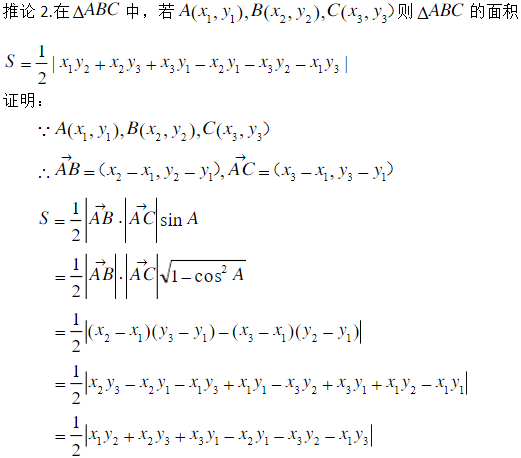

Largest Triangle Area

You have a list of points in the plane. Return the area of the largest triangle that can be formed by any 3 of the points.

Example:
Input: points = [[0,0],[0,1],[1,0],[0,2],[2,0]]
Output: 2
Explanation: 
The five points are show in the figure below. The red triangle is the largest.


Notes:

3 <= points.length <= 50.
No points will be duplicated.
 -50 <= points[i][j] <= 50.
Answers within 10^-6 of the true value will be accepted as correct.


给定包含多个点的集合，从其中取三个点组成三角形，返回能组成的最大三角形的面积。

示例:
输入: points = [[0,0],[0,1],[1,0],[0,2],[2,0]]
输出: 2
解释: 
这五个点如下图所示。组成的橙色三角形是最大的，面积为2。


注意:

3 <= points.length <= 50.
不存在重复的点。
 -50 <= points[i][j] <= 50.
结果误差值在 10^-6 以内都认为是正确答案。

思路
没有思路，只有公式，附带一张网上找的平面坐标系中三角形的面积公式推导图，有兴趣可以自己尝试推导搞搞，反正都还给老师了


```PYTHON
class Solution:
    def largestTriangleArea(self, points):
        """
        :type points: List[List[int]]
        :rtype: float
        """
        if not points:
            return 0.0
        maxArea = 0.0
        length = len(points)
        for i in range(length):
            iPoint = points[i]
            for j in range(i+1, length):
                jPoint = points[j]
                for k in range(j+1, length):
                    kPoint = points[k]
                    x1 = iPoint[0]
                    y1 = iPoint[1]
                    x2 = jPoint[0]
                    y2 = jPoint[1]
                    x3 = kPoint[0]
                    y3 = kPoint[1]
                    area = (x1*y2 + x2*y3 + x3*y1 - x2*y1 - x3*y2 - x1*y3)
                    area = area if (area > 0) else (0 - area)
                    area = area / 2
                    maxArea = max(maxArea, area)
        return float(maxArea)
```