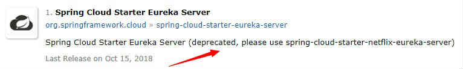
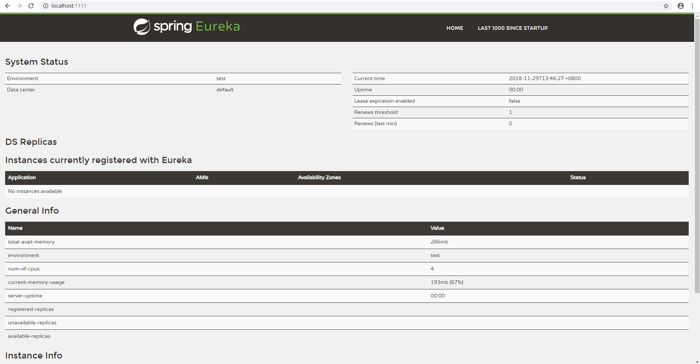
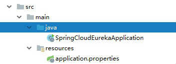
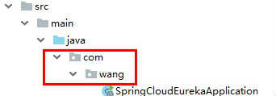
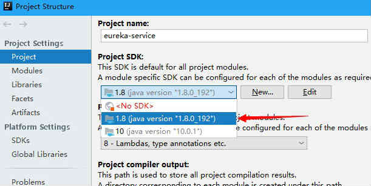

# Spring Cloud Eureka
2018年11月29日 10:31:15

## 操作环境
IntelliJ IDEA 2018.3 (Ultimate Edition)
JAVA SDK 1.8.0_192

## 实践
1. 创建一个maven项目，这里就不用多说了
2. pom 引入依赖
   ```XML
   <?xml version="1.0" encoding="UTF-8"?>
    <project xmlns="http://maven.apache.org/POM/4.0.0"
            xmlns:xsi="http://www.w3.org/2001/XMLSchema-instance"
            xsi:schemaLocation="http://maven.apache.org/POM/4.0.0 http://maven.apache.org/xsd/maven-4.0.0.xsd">
        <modelVersion>4.0.0</modelVersion>

        <groupId>com.n</groupId>
        <artifactId>test</artifactId>
        <version>1.0-SNAPSHOT</version>

        <parent>
            <groupId>org.springframework.boot</groupId>
            <artifactId>spring-boot-starter-parent</artifactId>
            <version>2.1.0.RELEASE</version>
            <relativePath/> <!-- lookup parent from repository -->
        </parent>

        <!-- 使用 dependencyManagement 进行版本管理 -->
        <dependencyManagement>
            <dependencies>
                <dependency>
                    <groupId>org.springframework.cloud</groupId>
                    <artifactId>spring-cloud-dependencies</artifactId>
                    <version>Finchley.SR2</version>
                    <type>pom</type>
                    <scope>import</scope>
                </dependency>
            </dependencies>
        </dependencyManagement>

        <dependencies>
            <!-- 引入 eureka server 依赖 -->
            <dependency>
                <groupId>org.springframework.cloud</groupId>
                <artifactId>spring-cloud-starter-netflix-eureka-server</artifactId>
            </dependency>
        </dependencies>
    </project>
   ```
   > **TIPS:** 有点教程引入的 eureka 依赖是 `spring-cloud-starter-eureka-server` 这个是已经不推荐的，在 maven 仓库可以查到
   > 
3. 创建 main 入口
   要先在 main/java 下创建一个包！！！这个很重要，比如建个 example ，然后再加入一个类 EurekaServiceApplication
   ```JAVA
    import org.springframework.boot.SpringApplication;
    import org.springframework.boot.autoconfigure.SpringBootApplication;
    import org.springframework.cloud.netflix.eureka.server.EnableEurekaServer;

    @EnableEurekaServer
    @SpringBootApplication
    public class EurekaServiceApplication {
        public static void main(String[] args) {
            SpringApplication.run(EurekaServiceApplication.class, args);
        }
    }
   ```
4. 配置文件
   配置文件可使用 .properties 或者 .yml ，我使用后者，因为更加清晰易读。注意的是冒号后面必须空格
   ```YML
    #设置tomcat服务端口号
    server:
      port: 1111

    #设置服务名称
    spring:
      application.name: eureka-service

    eureka:
      instance:
        hostname: localhost
      #注册中心不需要注册自己
      client:
        register-with-eureka: false
        #注册中心不需要去发现服务
        fetch-registry: false
        #设置服务注册中心的URL
        serviceUrl:
          defaultZone: http://${eureka.instance.hostname}:${server.port}/eureka
   ```
5. 启动
   如果没什么问题和意外，程序启动成功，访问 http://localhost:1111/
   
   搞定

## 遇到的问题
### **1. Your ApplicationContext is unlikely to start due to a @ComponentScan of the default package.**
```
2018-11-29 11:00:08.102  INFO 12396 --- [           main] trationDelegate$BeanPostProcessorChecker : Bean 'configurationPropertiesRebinderAutoConfiguration' of type [org.springframework.cloud.autoconfigure.ConfigurationPropertiesRebinderAutoConfiguration$$EnhancerBySpringCGLIB$$69882dd2] is not eligible for getting processed by all BeanPostProcessors (for example: not eligible for auto-proxying)

  .   ____          _            __ _ _
 /\\ / ___'_ __ _ _(_)_ __  __ _ \ \ \ \
( ( )\___ | '_ | '_| | '_ \/ _` | \ \ \ \
 \\/  ___)| |_)| | | | | || (_| |  ) ) ) )
  '  |____| .__|_| |_|_| |_\__, | / / / /
 =========|_|==============|___/=/_/_/_/
 :: Spring Boot ::        (v2.1.0.RELEASE)

2018-11-29 11:00:08.440  INFO 12396 --- [           main] SpringCloudEurekaApplication             : No active profile set, falling back to default profiles: default
2018-11-29 11:00:08.456  WARN 12396 --- [           main] ionWarningsApplicationContextInitializer : 

** WARNING ** : Your ApplicationContext is unlikely to start due to a @ComponentScan of the default package.


2018-11-29 11:04:33.174  WARN 12396 --- [           main] ConfigServletWebServerApplicationContext : Exception encountered during context initialization - cancelling refresh attempt: org.springframework.beans.factory.BeanDefinitionStoreException: Failed to read candidate component class: URL [jar:file:/E:/maven-repository/org/springframework/boot/spring-boot-autoconfigure/2.1.0.RELEASE/spring-boot-autoconfigure-2.1.0.RELEASE.jar!/org/springframework/boot/autoconfigure/jdbc/DataSourceAutoConfiguration$EmbeddedDatabaseConfiguration.class]; nested exception is java.lang.IllegalStateException: Could not evaluate condition on org.springframework.boot.autoconfigure.jdbc.DataSourceAutoConfiguration$EmbeddedDatabaseConfiguration due to org/springframework/jdbc/datasource/embedded/EmbeddedDatabaseType not found. Make sure your own configuration does not rely on that class. This can also happen if you are @ComponentScanning a springframework package (e.g. if you put a @ComponentScan in the default package by mistake)
2018-11-29 11:04:33.181  INFO 12396 --- [           main] ConditionEvaluationReportLoggingListener : 

Error starting ApplicationContext. To display the conditions report re-run your application with 'debug' enabled.
2018-11-29 11:04:33.193 ERROR 12396 --- [           main] o.s.boot.SpringApplication               : Application run failed

org.springframework.beans.factory.BeanDefinitionStoreException: Failed to read candidate component class: URL [jar:file:/E:/maven-repository/org/springframework/boot/spring-boot-autoconfigure/2.1.0.RELEASE/spring-boot-autoconfigure-2.1.0.RELEASE.jar!/org/springframework/boot/autoconfigure/jdbc/DataSourceAutoConfiguration$EmbeddedDatabaseConfiguration.class]; nested exception is java.lang.IllegalStateException: Could not evaluate condition on org.springframework.boot.autoconfigure.jdbc.DataSourceAutoConfiguration$EmbeddedDatabaseConfiguration due to org/springframework/jdbc/datasource/embedded/EmbeddedDatabaseType not found. Make sure your own configuration does not rely on that class. This can also happen if you are @ComponentScanning a springframework package (e.g. if you put a @ComponentScan in the default package by mistake)
	at org.springframework.context.annotation.ClassPathScanningCandidateComponentProvider.scanCandidateComponents(ClassPathScanningCandidateComponentProvider.java:454) ~[spring-context-5.1.2.RELEASE.jar:5.1.2.RELEASE]
	at org.springframework.context.annotation.ClassPathScanningCandidateComponentProvider.findCandidateComponents(ClassPathScanningCandidateComponentProvider.java:316) ~[spring-context-5.1.2.RELEASE.jar:5.1.2.RELEASE]
	at org.springframework.context.annotation.ClassPathBeanDefinitionScanner.doScan(ClassPathBeanDefinitionScanner.java:275) ~[spring-context-5.1.2.RELEASE.jar:5.1.2.RELEASE]
	at org.springframework.context.annotation.ComponentScanAnnotationParser.parse(ComponentScanAnnotationParser.java:132) ~[spring-context-5.1.2.RELEASE.jar:5.1.2.RELEASE]
	at org.springframework.context.annotation.ConfigurationClassParser.doProcessConfigurationClass(ConfigurationClassParser.java:287) ~[spring-context-5.1.2.RELEASE.jar:5.1.2.RELEASE]
	at org.springframework.context.annotation.ConfigurationClassParser.processConfigurationClass(ConfigurationClassParser.java:242) ~[spring-context-5.1.2.RELEASE.jar:5.1.2.RELEASE]
	at org.springframework.context.annotation.ConfigurationClassParser.parse(ConfigurationClassParser.java:199) ~[spring-context-5.1.2.RELEASE.jar:5.1.2.RELEASE]
	at org.springframework.context.annotation.ConfigurationClassParser.parse(ConfigurationClassParser.java:167) ~[spring-context-5.1.2.RELEASE.jar:5.1.2.RELEASE]
	at org.springframework.context.annotation.ConfigurationClassPostProcessor.processConfigBeanDefinitions(ConfigurationClassPostProcessor.java:315) ~[spring-context-5.1.2.RELEASE.jar:5.1.2.RELEASE]
	at org.springframework.context.annotation.ConfigurationClassPostProcessor.postProcessBeanDefinitionRegistry(ConfigurationClassPostProcessor.java:232) ~[spring-context-5.1.2.RELEASE.jar:5.1.2.RELEASE]
	at org.springframework.context.support.PostProcessorRegistrationDelegate.invokeBeanDefinitionRegistryPostProcessors(PostProcessorRegistrationDelegate.java:275) ~[spring-context-5.1.2.RELEASE.jar:5.1.2.RELEASE]
	at org.springframework.context.support.PostProcessorRegistrationDelegate.invokeBeanFactoryPostProcessors(PostProcessorRegistrationDelegate.java:95) ~[spring-context-5.1.2.RELEASE.jar:5.1.2.RELEASE]
	at org.springframework.context.support.AbstractApplicationContext.invokeBeanFactoryPostProcessors(AbstractApplicationContext.java:691) ~[spring-context-5.1.2.RELEASE.jar:5.1.2.RELEASE]
	at org.springframework.context.support.AbstractApplicationContext.refresh(AbstractApplicationContext.java:528) ~[spring-context-5.1.2.RELEASE.jar:5.1.2.RELEASE]
	at org.springframework.boot.web.servlet.context.ServletWebServerApplicationContext.refresh(ServletWebServerApplicationContext.java:140) ~[spring-boot-2.1.0.RELEASE.jar:2.1.0.RELEASE]
	at org.springframework.boot.SpringApplication.refresh(SpringApplication.java:775) [spring-boot-2.1.0.RELEASE.jar:2.1.0.RELEASE]
	at org.springframework.boot.SpringApplication.refreshContext(SpringApplication.java:397) [spring-boot-2.1.0.RELEASE.jar:2.1.0.RELEASE]
	at org.springframework.boot.SpringApplication.run(SpringApplication.java:316) [spring-boot-2.1.0.RELEASE.jar:2.1.0.RELEASE]
	at org.springframework.boot.SpringApplication.run(SpringApplication.java:1260) [spring-boot-2.1.0.RELEASE.jar:2.1.0.RELEASE]
	at org.springframework.boot.SpringApplication.run(SpringApplication.java:1248) [spring-boot-2.1.0.RELEASE.jar:2.1.0.RELEASE]
	at SpringCloudEurekaApplication.main(SpringCloudEurekaApplication.java:9) [classes/:na]
Caused by: java.lang.IllegalStateException: Could not evaluate condition on org.springframework.boot.autoconfigure.jdbc.DataSourceAutoConfiguration$EmbeddedDatabaseConfiguration due to org/springframework/jdbc/datasource/embedded/EmbeddedDatabaseType not found. Make sure your own configuration does not rely on that class. This can also happen if you are @ComponentScanning a springframework package (e.g. if you put a @ComponentScan in the default package by mistake)
	at org.springframework.boot.autoconfigure.condition.SpringBootCondition.matches(SpringBootCondition.java:55) ~[spring-boot-autoconfigure-2.1.0.RELEASE.jar:2.1.0.RELEASE]
	at org.springframework.context.annotation.ConditionEvaluator.shouldSkip(ConditionEvaluator.java:108) ~[spring-context-5.1.2.RELEASE.jar:5.1.2.RELEASE]
	at org.springframework.context.annotation.ConditionEvaluator.shouldSkip(ConditionEvaluator.java:88) ~[spring-context-5.1.2.RELEASE.jar:5.1.2.RELEASE]
	at org.springframework.context.annotation.ConditionEvaluator.shouldSkip(ConditionEvaluator.java:71) ~[spring-context-5.1.2.RELEASE.jar:5.1.2.RELEASE]
	at org.springframework.context.annotation.ClassPathScanningCandidateComponentProvider.isConditionMatch(ClassPathScanningCandidateComponentProvider.java:515) ~[spring-context-5.1.2.RELEASE.jar:5.1.2.RELEASE]
	at org.springframework.context.annotation.ClassPathScanningCandidateComponentProvider.isCandidateComponent(ClassPathScanningCandidateComponentProvider.java:498) ~[spring-context-5.1.2.RELEASE.jar:5.1.2.RELEASE]
	at org.springframework.context.annotation.ClassPathScanningCandidateComponentProvider.scanCandidateComponents(ClassPathScanningCandidateComponentProvider.java:431) ~[spring-context-5.1.2.RELEASE.jar:5.1.2.RELEASE]
	... 20 common frames omitted
Caused by: java.lang.NoClassDefFoundError: org/springframework/jdbc/datasource/embedded/EmbeddedDatabaseType
	at org.springframework.boot.jdbc.EmbeddedDatabaseConnection.<clinit>(EmbeddedDatabaseConnection.java:50) ~[spring-boot-2.1.0.RELEASE.jar:2.1.0.RELEASE]
	at org.springframework.boot.autoconfigure.jdbc.DataSourceAutoConfiguration$EmbeddedDatabaseCondition.getMatchOutcome(DataSourceAutoConfiguration.java:148) ~[spring-boot-autoconfigure-2.1.0.RELEASE.jar:2.1.0.RELEASE]
	at org.springframework.boot.autoconfigure.condition.SpringBootCondition.matches(SpringBootCondition.java:47) ~[spring-boot-autoconfigure-2.1.0.RELEASE.jar:2.1.0.RELEASE]
	... 26 common frames omitted
Caused by: java.lang.ClassNotFoundException: org.springframework.jdbc.datasource.embedded.EmbeddedDatabaseType
	at java.net.URLClassLoader.findClass(URLClassLoader.java:382) ~[na:1.8.0_192]
	at java.lang.ClassLoader.loadClass(ClassLoader.java:424) ~[na:1.8.0_192]
	at sun.misc.Launcher$AppClassLoader.loadClass(Launcher.java:349) ~[na:1.8.0_192]
	at java.lang.ClassLoader.loadClass(ClassLoader.java:357) ~[na:1.8.0_192]
	... 29 common frames omitted
```
原因：此时的项目路径如下，是错的！

解决：main入口方法文件不能直接放在main/java文件夹下，应当在建一个包，如我的修改之后：

对于这个问题， Spring-Boot 官方文档也有解释。说明对 spring-boot 还不深入
https://docs.spring.io/spring-boot/docs/current-SNAPSHOT/reference/htmlsingle/#using-boot-using-the-default-package
>14.1 Using the “default” Package
When a class does not include a package declaration, it is considered to be in the “default package”. The use of the “default package” is generally discouraged and should be avoided. It can cause particular problems for Spring Boot applications that use the `@ComponentScan`, `@EntityScan`, or `@SpringBootApplication` annotations, since every class from every jar is read.
>
>[Tip]
>> We recommend that you follow Java’s recommended package naming conventions and use a reversed domain name (for example, `com.example.project`).

### **2. com.sun.jersey.api.client.ClientHandlerException: java.net.ConnectException: Connection refused: connect**
```
com.sun.jersey.api.client.ClientHandlerException: java.net.ConnectException: Connection refused: connect
	at com.sun.jersey.client.apache4.ApacheHttpClient4Handler.handle(ApacheHttpClient4Handler.java:187) ~[jersey-apache-client4-1.19.1.jar:1.19.1]
	at com.sun.jersey.api.client.filter.GZIPContentEncodingFilter.handle(GZIPContentEncodingFilter.java:123) ~[jersey-client-1.19.1.jar:1.19.1]
	at com.netflix.discovery.EurekaIdentityHeaderFilter.handle(EurekaIdentityHeaderFilter.java:27) ~[eureka-client-1.9.3.jar:1.9.3]
	at com.sun.jersey.api.client.Client.handle(Client.java:652) ~[jersey-client-1.19.1.jar:1.19.1]
	at com.sun.jersey.api.client.WebResource.handle(WebResource.java:682) ~[jersey-client-1.19.1.jar:1.19.1]
	at com.sun.jersey.api.client.WebResource.access$200(WebResource.java:74) ~[jersey-client-1.19.1.jar:1.19.1]
	at com.sun.jersey.api.client.WebResource$Builder.get(WebResource.java:509) ~[jersey-client-1.19.1.jar:1.19.1]
	at com.netflix.discovery.shared.transport.jersey.AbstractJerseyEurekaHttpClient.getApplicationsInternal(AbstractJerseyEurekaHttpClient.java:194) ~[eureka-client-1.9.3.jar:1.9.3]
	at com.netflix.discovery.shared.transport.jersey.AbstractJerseyEurekaHttpClient.getApplications(AbstractJerseyEurekaHttpClient.java:165) ~[eureka-client-1.9.3.jar:1.9.3]
	at com.netflix.discovery.shared.transport.decorator.EurekaHttpClientDecorator$6.execute(EurekaHttpClientDecorator.java:137) [eureka-client-1.9.3.jar:1.9.3]
	at com.netflix.discovery.shared.transport.decorator.MetricsCollectingEurekaHttpClient.execute(MetricsCollectingEurekaHttpClient.java:73) ~[eureka-client-1.9.3.jar:1.9.3]
	at com.netflix.discovery.shared.transport.decorator.EurekaHttpClientDecorator.getApplications(EurekaHttpClientDecorator.java:134) [eureka-client-1.9.3.jar:1.9.3]
	at com.netflix.discovery.shared.transport.decorator.EurekaHttpClientDecorator$6.execute(EurekaHttpClientDecorator.java:137) [eureka-client-1.9.3.jar:1.9.3]
	at com.netflix.discovery.shared.transport.decorator.RedirectingEurekaHttpClient.executeOnNewServer(RedirectingEurekaHttpClient.java:118) ~[eureka-client-1.9.3.jar:1.9.3]
	at com.netflix.discovery.shared.transport.decorator.RedirectingEurekaHttpClient.execute(RedirectingEurekaHttpClient.java:79) ~[eureka-client-1.9.3.jar:1.9.3]
	at com.netflix.discovery.shared.transport.decorator.EurekaHttpClientDecorator.getApplications(EurekaHttpClientDecorator.java:134) [eureka-client-1.9.3.jar:1.9.3]
	at com.netflix.discovery.shared.transport.decorator.EurekaHttpClientDecorator$6.execute(EurekaHttpClientDecorator.java:137) [eureka-client-1.9.3.jar:1.9.3]
	at com.netflix.discovery.shared.transport.decorator.RetryableEurekaHttpClient.execute(RetryableEurekaHttpClient.java:120) [eureka-client-1.9.3.jar:1.9.3]
	at com.netflix.discovery.shared.transport.decorator.EurekaHttpClientDecorator.getApplications(EurekaHttpClientDecorator.java:134) [eureka-client-1.9.3.jar:1.9.3]
	at com.netflix.discovery.shared.transport.decorator.EurekaHttpClientDecorator$6.execute(EurekaHttpClientDecorator.java:137) [eureka-client-1.9.3.jar:1.9.3]
	at com.netflix.discovery.shared.transport.decorator.SessionedEurekaHttpClient.execute(SessionedEurekaHttpClient.java:77) [eureka-client-1.9.3.jar:1.9.3]
	at com.netflix.discovery.shared.transport.decorator.EurekaHttpClientDecorator.getApplications(EurekaHttpClientDecorator.java:134) [eureka-client-1.9.3.jar:1.9.3]
	at com.netflix.discovery.DiscoveryClient.getAndStoreFullRegistry(DiscoveryClient.java:1051) [eureka-client-1.9.3.jar:1.9.3]
	at com.netflix.discovery.DiscoveryClient.fetchRegistry(DiscoveryClient.java:965) [eureka-client-1.9.3.jar:1.9.3]
	at com.netflix.discovery.DiscoveryClient.<init>(DiscoveryClient.java:414) [eureka-client-1.9.3.jar:1.9.3]
	at com.netflix.discovery.DiscoveryClient.<init>(DiscoveryClient.java:269) [eureka-client-1.9.3.jar:1.9.3]
	at org.springframework.cloud.netflix.eureka.CloudEurekaClient.<init>(CloudEurekaClient.java:63) [spring-cloud-netflix-eureka-client-2.0.2.RELEASE.jar:2.0.2.RELEASE]
	at org.springframework.cloud.netflix.eureka.EurekaClientAutoConfiguration$RefreshableEurekaClientConfiguration.eurekaClient(EurekaClientAutoConfiguration.java:290) [spring-cloud-netflix-eureka-client-2.0.2.RELEASE.jar:2.0.2.RELEASE]
	at org.springframework.cloud.netflix.eureka.EurekaClientAutoConfiguration$RefreshableEurekaClientConfiguration$$EnhancerBySpringCGLIB$$9a495728.CGLIB$eurekaClient$2(<generated>) [spring-cloud-netflix-eureka-client-2.0.2.RELEASE.jar:2.0.2.RELEASE]
	at org.springframework.cloud.netflix.eureka.EurekaClientAutoConfiguration$RefreshableEurekaClientConfiguration$$EnhancerBySpringCGLIB$$9a495728$$FastClassBySpringCGLIB$$12f4f3f7.invoke(<generated>) [spring-cloud-netflix-eureka-client-2.0.2.RELEASE.jar:2.0.2.RELEASE]
	at org.springframework.cglib.proxy.MethodProxy.invokeSuper(MethodProxy.java:244) [spring-core-5.1.2.RELEASE.jar:5.1.2.RELEASE]
	at org.springframework.context.annotation.ConfigurationClassEnhancer$BeanMethodInterceptor.intercept(ConfigurationClassEnhancer.java:363) [spring-context-5.1.2.RELEASE.jar:5.1.2.RELEASE]
	at org.springframework.cloud.netflix.eureka.EurekaClientAutoConfiguration$RefreshableEurekaClientConfiguration$$EnhancerBySpringCGLIB$$9a495728.eurekaClient(<generated>) [spring-cloud-netflix-eureka-client-2.0.2.RELEASE.jar:2.0.2.RELEASE]
	at sun.reflect.NativeMethodAccessorImpl.invoke0(Native Method) ~[na:1.8.0_192]
	at sun.reflect.NativeMethodAccessorImpl.invoke(NativeMethodAccessorImpl.java:62) ~[na:1.8.0_192]
	at sun.reflect.DelegatingMethodAccessorImpl.invoke(DelegatingMethodAccessorImpl.java:43) ~[na:1.8.0_192]
	at java.lang.reflect.Method.invoke(Method.java:498) ~[na:1.8.0_192]
	at org.springframework.beans.factory.support.SimpleInstantiationStrategy.instantiate(SimpleInstantiationStrategy.java:154) [spring-beans-5.1.2.RELEASE.jar:5.1.2.RELEASE]
	at org.springframework.beans.factory.support.ConstructorResolver.instantiate(ConstructorResolver.java:620) [spring-beans-5.1.2.RELEASE.jar:5.1.2.RELEASE]
	at org.springframework.beans.factory.support.ConstructorResolver.instantiateUsingFactoryMethod(ConstructorResolver.java:605) [spring-beans-5.1.2.RELEASE.jar:5.1.2.RELEASE]
	at org.springframework.beans.factory.support.AbstractAutowireCapableBeanFactory.instantiateUsingFactoryMethod(AbstractAutowireCapableBeanFactory.java:1288) [spring-beans-5.1.2.RELEASE.jar:5.1.2.RELEASE]
	at org.springframework.beans.factory.support.AbstractAutowireCapableBeanFactory.createBeanInstance(AbstractAutowireCapableBeanFactory.java:1127) [spring-beans-5.1.2.RELEASE.jar:5.1.2.RELEASE]
	at org.springframework.beans.factory.support.AbstractAutowireCapableBeanFactory.doCreateBean(AbstractAutowireCapableBeanFactory.java:538) [spring-beans-5.1.2.RELEASE.jar:5.1.2.RELEASE]
	at org.springframework.beans.factory.support.AbstractAutowireCapableBeanFactory.createBean(AbstractAutowireCapableBeanFactory.java:498) [spring-beans-5.1.2.RELEASE.jar:5.1.2.RELEASE]
	at org.springframework.beans.factory.support.AbstractBeanFactory.lambda$doGetBean$1(AbstractBeanFactory.java:356) [spring-beans-5.1.2.RELEASE.jar:5.1.2.RELEASE]
	at org.springframework.cloud.context.scope.GenericScope$BeanLifecycleWrapper.getBean(GenericScope.java:390) ~[spring-cloud-context-2.0.2.RELEASE.jar:2.0.2.RELEASE]
	at org.springframework.cloud.context.scope.GenericScope.get(GenericScope.java:184) ~[spring-cloud-context-2.0.2.RELEASE.jar:2.0.2.RELEASE]
	at org.springframework.beans.factory.support.AbstractBeanFactory.doGetBean(AbstractBeanFactory.java:353) [spring-beans-5.1.2.RELEASE.jar:5.1.2.RELEASE]
	at org.springframework.beans.factory.support.AbstractBeanFactory.getBean(AbstractBeanFactory.java:199) [spring-beans-5.1.2.RELEASE.jar:5.1.2.RELEASE]
	at org.springframework.aop.target.SimpleBeanTargetSource.getTarget(SimpleBeanTargetSource.java:35) ~[spring-aop-5.1.2.RELEASE.jar:5.1.2.RELEASE]
	at org.springframework.aop.framework.JdkDynamicAopProxy.invoke(JdkDynamicAopProxy.java:193) ~[spring-aop-5.1.2.RELEASE.jar:5.1.2.RELEASE]
	at com.sun.proxy.$Proxy96.getApplications(Unknown Source) ~[na:na]
	at org.springframework.cloud.netflix.eureka.server.EurekaServerAutoConfiguration.peerAwareInstanceRegistry(EurekaServerAutoConfiguration.java:164) ~[spring-cloud-netflix-eureka-server-2.0.2.RELEASE.jar:2.0.2.RELEASE]
	at org.springframework.cloud.netflix.eureka.server.EurekaServerAutoConfiguration$$EnhancerBySpringCGLIB$$2c5961ea.CGLIB$peerAwareInstanceRegistry$4(<generated>) ~[spring-cloud-netflix-eureka-server-2.0.2.RELEASE.jar:2.0.2.RELEASE]
	at org.springframework.cloud.netflix.eureka.server.EurekaServerAutoConfiguration$$EnhancerBySpringCGLIB$$2c5961ea$$FastClassBySpringCGLIB$$fd8fd0ec.invoke(<generated>) ~[spring-cloud-netflix-eureka-server-2.0.2.RELEASE.jar:2.0.2.RELEASE]
	at org.springframework.cglib.proxy.MethodProxy.invokeSuper(MethodProxy.java:244) [spring-core-5.1.2.RELEASE.jar:5.1.2.RELEASE]
	at org.springframework.context.annotation.ConfigurationClassEnhancer$BeanMethodInterceptor.intercept(ConfigurationClassEnhancer.java:363) [spring-context-5.1.2.RELEASE.jar:5.1.2.RELEASE]
	at org.springframework.cloud.netflix.eureka.server.EurekaServerAutoConfiguration$$EnhancerBySpringCGLIB$$2c5961ea.peerAwareInstanceRegistry(<generated>) ~[spring-cloud-netflix-eureka-server-2.0.2.RELEASE.jar:2.0.2.RELEASE]
	at sun.reflect.NativeMethodAccessorImpl.invoke0(Native Method) ~[na:1.8.0_192]
	at sun.reflect.NativeMethodAccessorImpl.invoke(NativeMethodAccessorImpl.java:62) ~[na:1.8.0_192]
	at sun.reflect.DelegatingMethodAccessorImpl.invoke(DelegatingMethodAccessorImpl.java:43) ~[na:1.8.0_192]
	at java.lang.reflect.Method.invoke(Method.java:498) ~[na:1.8.0_192]
	at org.springframework.beans.factory.support.SimpleInstantiationStrategy.instantiate(SimpleInstantiationStrategy.java:154) [spring-beans-5.1.2.RELEASE.jar:5.1.2.RELEASE]
	at org.springframework.beans.factory.support.ConstructorResolver.instantiate(ConstructorResolver.java:620) [spring-beans-5.1.2.RELEASE.jar:5.1.2.RELEASE]
	at org.springframework.beans.factory.support.ConstructorResolver.instantiateUsingFactoryMethod(ConstructorResolver.java:605) [spring-beans-5.1.2.RELEASE.jar:5.1.2.RELEASE]
	at org.springframework.beans.factory.support.AbstractAutowireCapableBeanFactory.instantiateUsingFactoryMethod(AbstractAutowireCapableBeanFactory.java:1288) [spring-beans-5.1.2.RELEASE.jar:5.1.2.RELEASE]
	at org.springframework.beans.factory.support.AbstractAutowireCapableBeanFactory.createBeanInstance(AbstractAutowireCapableBeanFactory.java:1127) [spring-beans-5.1.2.RELEASE.jar:5.1.2.RELEASE]
	at org.springframework.beans.factory.support.AbstractAutowireCapableBeanFactory.doCreateBean(AbstractAutowireCapableBeanFactory.java:538) [spring-beans-5.1.2.RELEASE.jar:5.1.2.RELEASE]
	at org.springframework.beans.factory.support.AbstractAutowireCapableBeanFactory.createBean(AbstractAutowireCapableBeanFactory.java:498) [spring-beans-5.1.2.RELEASE.jar:5.1.2.RELEASE]
	at org.springframework.beans.factory.support.AbstractBeanFactory.lambda$doGetBean$0(AbstractBeanFactory.java:320) [spring-beans-5.1.2.RELEASE.jar:5.1.2.RELEASE]
	at org.springframework.beans.factory.support.DefaultSingletonBeanRegistry.getSingleton(DefaultSingletonBeanRegistry.java:222) ~[spring-beans-5.1.2.RELEASE.jar:5.1.2.RELEASE]
	at org.springframework.beans.factory.support.AbstractBeanFactory.doGetBean(AbstractBeanFactory.java:318) [spring-beans-5.1.2.RELEASE.jar:5.1.2.RELEASE]
	at org.springframework.beans.factory.support.AbstractBeanFactory.getBean(AbstractBeanFactory.java:199) [spring-beans-5.1.2.RELEASE.jar:5.1.2.RELEASE]
	at org.springframework.beans.factory.config.DependencyDescriptor.resolveCandidate(DependencyDescriptor.java:273) ~[spring-beans-5.1.2.RELEASE.jar:5.1.2.RELEASE]
	at org.springframework.beans.factory.support.DefaultListableBeanFactory.doResolveDependency(DefaultListableBeanFactory.java:1239) ~[spring-beans-5.1.2.RELEASE.jar:5.1.2.RELEASE]
	at org.springframework.beans.factory.support.DefaultListableBeanFactory.resolveDependency(DefaultListableBeanFactory.java:1166) ~[spring-beans-5.1.2.RELEASE.jar:5.1.2.RELEASE]
	at org.springframework.beans.factory.support.ConstructorResolver.resolveAutowiredArgument(ConstructorResolver.java:855) [spring-beans-5.1.2.RELEASE.jar:5.1.2.RELEASE]
	at org.springframework.beans.factory.support.ConstructorResolver.createArgumentArray(ConstructorResolver.java:758) [spring-beans-5.1.2.RELEASE.jar:5.1.2.RELEASE]
	at org.springframework.beans.factory.support.ConstructorResolver.instantiateUsingFactoryMethod(ConstructorResolver.java:508) [spring-beans-5.1.2.RELEASE.jar:5.1.2.RELEASE]
	at org.springframework.beans.factory.support.AbstractAutowireCapableBeanFactory.instantiateUsingFactoryMethod(AbstractAutowireCapableBeanFactory.java:1288) [spring-beans-5.1.2.RELEASE.jar:5.1.2.RELEASE]
	at org.springframework.beans.factory.support.AbstractAutowireCapableBeanFactory.createBeanInstance(AbstractAutowireCapableBeanFactory.java:1127) [spring-beans-5.1.2.RELEASE.jar:5.1.2.RELEASE]
	at org.springframework.beans.factory.support.AbstractAutowireCapableBeanFactory.doCreateBean(AbstractAutowireCapableBeanFactory.java:538) [spring-beans-5.1.2.RELEASE.jar:5.1.2.RELEASE]
	at org.springframework.beans.factory.support.AbstractAutowireCapableBeanFactory.createBean(AbstractAutowireCapableBeanFactory.java:498) [spring-beans-5.1.2.RELEASE.jar:5.1.2.RELEASE]
	at org.springframework.beans.factory.support.AbstractBeanFactory.lambda$doGetBean$0(AbstractBeanFactory.java:320) [spring-beans-5.1.2.RELEASE.jar:5.1.2.RELEASE]
	at org.springframework.beans.factory.support.DefaultSingletonBeanRegistry.getSingleton(DefaultSingletonBeanRegistry.java:222) ~[spring-beans-5.1.2.RELEASE.jar:5.1.2.RELEASE]
	at org.springframework.beans.factory.support.AbstractBeanFactory.doGetBean(AbstractBeanFactory.java:318) [spring-beans-5.1.2.RELEASE.jar:5.1.2.RELEASE]
	at org.springframework.beans.factory.support.AbstractBeanFactory.getBean(AbstractBeanFactory.java:199) [spring-beans-5.1.2.RELEASE.jar:5.1.2.RELEASE]
	at org.springframework.beans.factory.config.DependencyDescriptor.resolveCandidate(DependencyDescriptor.java:273) ~[spring-beans-5.1.2.RELEASE.jar:5.1.2.RELEASE]
	at org.springframework.beans.factory.support.DefaultListableBeanFactory.doResolveDependency(DefaultListableBeanFactory.java:1239) ~[spring-beans-5.1.2.RELEASE.jar:5.1.2.RELEASE]
	at org.springframework.beans.factory.support.DefaultListableBeanFactory.resolveDependency(DefaultListableBeanFactory.java:1166) ~[spring-beans-5.1.2.RELEASE.jar:5.1.2.RELEASE]
	at org.springframework.beans.factory.annotation.AutowiredAnnotationBeanPostProcessor$AutowiredFieldElement.inject(AutowiredAnnotationBeanPostProcessor.java:593) ~[spring-beans-5.1.2.RELEASE.jar:5.1.2.RELEASE]
	at org.springframework.beans.factory.annotation.InjectionMetadata.inject(InjectionMetadata.java:90) ~[spring-beans-5.1.2.RELEASE.jar:5.1.2.RELEASE]
	at org.springframework.beans.factory.annotation.AutowiredAnnotationBeanPostProcessor.postProcessProperties(AutowiredAnnotationBeanPostProcessor.java:374) ~[spring-beans-5.1.2.RELEASE.jar:5.1.2.RELEASE]
	at org.springframework.beans.factory.support.AbstractAutowireCapableBeanFactory.populateBean(AbstractAutowireCapableBeanFactory.java:1378) [spring-beans-5.1.2.RELEASE.jar:5.1.2.RELEASE]
	at org.springframework.beans.factory.support.AbstractAutowireCapableBeanFactory.doCreateBean(AbstractAutowireCapableBeanFactory.java:575) [spring-beans-5.1.2.RELEASE.jar:5.1.2.RELEASE]
	at org.springframework.beans.factory.support.AbstractAutowireCapableBeanFactory.createBean(AbstractAutowireCapableBeanFactory.java:498) [spring-beans-5.1.2.RELEASE.jar:5.1.2.RELEASE]
	at org.springframework.beans.factory.support.AbstractBeanFactory.lambda$doGetBean$0(AbstractBeanFactory.java:320) [spring-beans-5.1.2.RELEASE.jar:5.1.2.RELEASE]
	at org.springframework.beans.factory.support.DefaultSingletonBeanRegistry.getSingleton(DefaultSingletonBeanRegistry.java:222) ~[spring-beans-5.1.2.RELEASE.jar:5.1.2.RELEASE]
	at org.springframework.beans.factory.support.AbstractBeanFactory.doGetBean(AbstractBeanFactory.java:318) [spring-beans-5.1.2.RELEASE.jar:5.1.2.RELEASE]
	at org.springframework.beans.factory.support.AbstractBeanFactory.getBean(AbstractBeanFactory.java:199) [spring-beans-5.1.2.RELEASE.jar:5.1.2.RELEASE]
	at org.springframework.beans.factory.support.DefaultListableBeanFactory.preInstantiateSingletons(DefaultListableBeanFactory.java:846) ~[spring-beans-5.1.2.RELEASE.jar:5.1.2.RELEASE]
	at org.springframework.context.support.AbstractApplicationContext.finishBeanFactoryInitialization(AbstractApplicationContext.java:863) ~[spring-context-5.1.2.RELEASE.jar:5.1.2.RELEASE]
	at org.springframework.context.support.AbstractApplicationContext.refresh(AbstractApplicationContext.java:546) ~[spring-context-5.1.2.RELEASE.jar:5.1.2.RELEASE]
	at org.springframework.boot.web.servlet.context.ServletWebServerApplicationContext.refresh(ServletWebServerApplicationContext.java:140) ~[spring-boot-2.1.0.RELEASE.jar:2.1.0.RELEASE]
	at org.springframework.boot.SpringApplication.refresh(SpringApplication.java:775) ~[spring-boot-2.1.0.RELEASE.jar:2.1.0.RELEASE]
	at org.springframework.boot.SpringApplication.refreshContext(SpringApplication.java:397) ~[spring-boot-2.1.0.RELEASE.jar:2.1.0.RELEASE]
	at org.springframework.boot.SpringApplication.run(SpringApplication.java:316) ~[spring-boot-2.1.0.RELEASE.jar:2.1.0.RELEASE]
	at org.springframework.boot.SpringApplication.run(SpringApplication.java:1260) ~[spring-boot-2.1.0.RELEASE.jar:2.1.0.RELEASE]
	at org.springframework.boot.SpringApplication.run(SpringApplication.java:1248) ~[spring-boot-2.1.0.RELEASE.jar:2.1.0.RELEASE]
	at com.wang.SpringCloudEurekaApplication.main(SpringCloudEurekaApplication.java:11) ~[classes/:na]
Caused by: java.net.ConnectException: Connection refused: connect
	at java.net.DualStackPlainSocketImpl.waitForConnect(Native Method) ~[na:1.8.0_192]
	at java.net.DualStackPlainSocketImpl.socketConnect(DualStackPlainSocketImpl.java:85) ~[na:1.8.0_192]
	at java.net.AbstractPlainSocketImpl.doConnect(AbstractPlainSocketImpl.java:350) ~[na:1.8.0_192]
	at java.net.AbstractPlainSocketImpl.connectToAddress(AbstractPlainSocketImpl.java:206) ~[na:1.8.0_192]
	at java.net.AbstractPlainSocketImpl.connect(AbstractPlainSocketImpl.java:188) ~[na:1.8.0_192]
	at java.net.PlainSocketImpl.connect(PlainSocketImpl.java:172) ~[na:1.8.0_192]
	at java.net.SocksSocketImpl.connect(SocksSocketImpl.java:392) ~[na:1.8.0_192]
	at java.net.Socket.connect(Socket.java:589) ~[na:1.8.0_192]
	at org.apache.http.conn.scheme.PlainSocketFactory.connectSocket(PlainSocketFactory.java:121) ~[httpclient-4.5.6.jar:4.5.6]
	at org.apache.http.impl.conn.DefaultClientConnectionOperator.openConnection(DefaultClientConnectionOperator.java:180) ~[httpclient-4.5.6.jar:4.5.6]
	at org.apache.http.impl.conn.AbstractPoolEntry.open(AbstractPoolEntry.java:144) ~[httpclient-4.5.6.jar:4.5.6]
	at org.apache.http.impl.conn.AbstractPooledConnAdapter.open(AbstractPooledConnAdapter.java:134) ~[httpclient-4.5.6.jar:4.5.6]
	at org.apache.http.impl.client.DefaultRequestDirector.tryConnect(DefaultRequestDirector.java:610) ~[httpclient-4.5.6.jar:4.5.6]
	at org.apache.http.impl.client.DefaultRequestDirector.execute(DefaultRequestDirector.java:445) ~[httpclient-4.5.6.jar:4.5.6]
	at org.apache.http.impl.client.AbstractHttpClient.doExecute(AbstractHttpClient.java:835) ~[httpclient-4.5.6.jar:4.5.6]
	at org.apache.http.impl.client.CloseableHttpClient.execute(CloseableHttpClient.java:118) ~[httpclient-4.5.6.jar:4.5.6]
	at org.apache.http.impl.client.CloseableHttpClient.execute(CloseableHttpClient.java:56) ~[httpclient-4.5.6.jar:4.5.6]
	at com.sun.jersey.client.apache4.ApacheHttpClient4Handler.handle(ApacheHttpClient4Handler.java:173) ~[jersey-apache-client4-1.19.1.jar:1.19.1]
  ... 109 common frames omitted

com.netflix.discovery.shared.transport.TransportException: Cannot execute request on any known server
	at com.netflix.discovery.shared.transport.decorator.RetryableEurekaHttpClient.execute(RetryableEurekaHttpClient.java:112) ~[eureka-client-1.9.3.jar:1.9.3]
	at com.netflix.discovery.shared.transport.decorator.EurekaHttpClientDecorator.getApplications(EurekaHttpClientDecorator.java:134) ~[eureka-client-1.9.3.jar:1.9.3]
	at com.netflix.discovery.shared.transport.decorator.EurekaHttpClientDecorator$6.execute(EurekaHttpClientDecorator.java:137) ~[eureka-client-1.9.3.jar:1.9.3]
	at com.netflix.discovery.shared.transport.decorator.SessionedEurekaHttpClient.execute(SessionedEurekaHttpClient.java:77) ~[eureka-client-1.9.3.jar:1.9.3]
	at com.netflix.discovery.shared.transport.decorator.EurekaHttpClientDecorator.getApplications(EurekaHttpClientDecorator.java:134) ~[eureka-client-1.9.3.jar:1.9.3]
	at com.netflix.discovery.DiscoveryClient.getAndStoreFullRegistry(DiscoveryClient.java:1051) [eureka-client-1.9.3.jar:1.9.3]
	at com.netflix.discovery.DiscoveryClient.fetchRegistry(DiscoveryClient.java:965) [eureka-client-1.9.3.jar:1.9.3]
	at com.netflix.discovery.DiscoveryClient.<init>(DiscoveryClient.java:414) [eureka-client-1.9.3.jar:1.9.3]
	at com.netflix.discovery.DiscoveryClient.<init>(DiscoveryClient.java:269) [eureka-client-1.9.3.jar:1.9.3]
	at org.springframework.cloud.netflix.eureka.CloudEurekaClient.<init>(CloudEurekaClient.java:63) [spring-cloud-netflix-eureka-client-2.0.2.RELEASE.jar:2.0.2.RELEASE]
	at org.springframework.cloud.netflix.eureka.EurekaClientAutoConfiguration$RefreshableEurekaClientConfiguration.eurekaClient(EurekaClientAutoConfiguration.java:290) [spring-cloud-netflix-eureka-client-2.0.2.RELEASE.jar:2.0.2.RELEASE]
	at org.springframework.cloud.netflix.eureka.EurekaClientAutoConfiguration$RefreshableEurekaClientConfiguration$$EnhancerBySpringCGLIB$$9a495728.CGLIB$eurekaClient$2(<generated>) [spring-cloud-netflix-eureka-client-2.0.2.RELEASE.jar:2.0.2.RELEASE]
	at org.springframework.cloud.netflix.eureka.EurekaClientAutoConfiguration$RefreshableEurekaClientConfiguration$$EnhancerBySpringCGLIB$$9a495728$$FastClassBySpringCGLIB$$12f4f3f7.invoke(<generated>) [spring-cloud-netflix-eureka-client-2.0.2.RELEASE.jar:2.0.2.RELEASE]
	at org.springframework.cglib.proxy.MethodProxy.invokeSuper(MethodProxy.java:244) [spring-core-5.1.2.RELEASE.jar:5.1.2.RELEASE]
	at org.springframework.context.annotation.ConfigurationClassEnhancer$BeanMethodInterceptor.intercept(ConfigurationClassEnhancer.java:363) [spring-context-5.1.2.RELEASE.jar:5.1.2.RELEASE]
	at org.springframework.cloud.netflix.eureka.EurekaClientAutoConfiguration$RefreshableEurekaClientConfiguration$$EnhancerBySpringCGLIB$$9a495728.eurekaClient(<generated>) [spring-cloud-netflix-eureka-client-2.0.2.RELEASE.jar:2.0.2.RELEASE]
	at sun.reflect.NativeMethodAccessorImpl.invoke0(Native Method) ~[na:1.8.0_192]
	at sun.reflect.NativeMethodAccessorImpl.invoke(NativeMethodAccessorImpl.java:62) ~[na:1.8.0_192]
	at sun.reflect.DelegatingMethodAccessorImpl.invoke(DelegatingMethodAccessorImpl.java:43) ~[na:1.8.0_192]
	at java.lang.reflect.Method.invoke(Method.java:498) ~[na:1.8.0_192]
	at org.springframework.beans.factory.support.SimpleInstantiationStrategy.instantiate(SimpleInstantiationStrategy.java:154) [spring-beans-5.1.2.RELEASE.jar:5.1.2.RELEASE]
	at org.springframework.beans.factory.support.ConstructorResolver.instantiate(ConstructorResolver.java:620) [spring-beans-5.1.2.RELEASE.jar:5.1.2.RELEASE]
	at org.springframework.beans.factory.support.ConstructorResolver.instantiateUsingFactoryMethod(ConstructorResolver.java:605) [spring-beans-5.1.2.RELEASE.jar:5.1.2.RELEASE]
	at org.springframework.beans.factory.support.AbstractAutowireCapableBeanFactory.instantiateUsingFactoryMethod(AbstractAutowireCapableBeanFactory.java:1288) [spring-beans-5.1.2.RELEASE.jar:5.1.2.RELEASE]
	at org.springframework.beans.factory.support.AbstractAutowireCapableBeanFactory.createBeanInstance(AbstractAutowireCapableBeanFactory.java:1127) [spring-beans-5.1.2.RELEASE.jar:5.1.2.RELEASE]
	at org.springframework.beans.factory.support.AbstractAutowireCapableBeanFactory.doCreateBean(AbstractAutowireCapableBeanFactory.java:538) [spring-beans-5.1.2.RELEASE.jar:5.1.2.RELEASE]
	at org.springframework.beans.factory.support.AbstractAutowireCapableBeanFactory.createBean(AbstractAutowireCapableBeanFactory.java:498) [spring-beans-5.1.2.RELEASE.jar:5.1.2.RELEASE]
	at org.springframework.beans.factory.support.AbstractBeanFactory.lambda$doGetBean$1(AbstractBeanFactory.java:356) [spring-beans-5.1.2.RELEASE.jar:5.1.2.RELEASE]
	at org.springframework.cloud.context.scope.GenericScope$BeanLifecycleWrapper.getBean(GenericScope.java:390) ~[spring-cloud-context-2.0.2.RELEASE.jar:2.0.2.RELEASE]
	at org.springframework.cloud.context.scope.GenericScope.get(GenericScope.java:184) ~[spring-cloud-context-2.0.2.RELEASE.jar:2.0.2.RELEASE]
	at org.springframework.beans.factory.support.AbstractBeanFactory.doGetBean(AbstractBeanFactory.java:353) [spring-beans-5.1.2.RELEASE.jar:5.1.2.RELEASE]
	at org.springframework.beans.factory.support.AbstractBeanFactory.getBean(AbstractBeanFactory.java:199) [spring-beans-5.1.2.RELEASE.jar:5.1.2.RELEASE]
	at org.springframework.aop.target.SimpleBeanTargetSource.getTarget(SimpleBeanTargetSource.java:35) ~[spring-aop-5.1.2.RELEASE.jar:5.1.2.RELEASE]
	at org.springframework.aop.framework.JdkDynamicAopProxy.invoke(JdkDynamicAopProxy.java:193) ~[spring-aop-5.1.2.RELEASE.jar:5.1.2.RELEASE]
	at com.sun.proxy.$Proxy96.getApplications(Unknown Source) ~[na:na]
	at org.springframework.cloud.netflix.eureka.server.EurekaServerAutoConfiguration.peerAwareInstanceRegistry(EurekaServerAutoConfiguration.java:164) ~[spring-cloud-netflix-eureka-server-2.0.2.RELEASE.jar:2.0.2.RELEASE]
	at org.springframework.cloud.netflix.eureka.server.EurekaServerAutoConfiguration$$EnhancerBySpringCGLIB$$2c5961ea.CGLIB$peerAwareInstanceRegistry$4(<generated>) ~[spring-cloud-netflix-eureka-server-2.0.2.RELEASE.jar:2.0.2.RELEASE]
	at org.springframework.cloud.netflix.eureka.server.EurekaServerAutoConfiguration$$EnhancerBySpringCGLIB$$2c5961ea$$FastClassBySpringCGLIB$$fd8fd0ec.invoke(<generated>) ~[spring-cloud-netflix-eureka-server-2.0.2.RELEASE.jar:2.0.2.RELEASE]
	at org.springframework.cglib.proxy.MethodProxy.invokeSuper(MethodProxy.java:244) [spring-core-5.1.2.RELEASE.jar:5.1.2.RELEASE]
	at org.springframework.context.annotation.ConfigurationClassEnhancer$BeanMethodInterceptor.intercept(ConfigurationClassEnhancer.java:363) [spring-context-5.1.2.RELEASE.jar:5.1.2.RELEASE]
	at org.springframework.cloud.netflix.eureka.server.EurekaServerAutoConfiguration$$EnhancerBySpringCGLIB$$2c5961ea.peerAwareInstanceRegistry(<generated>) ~[spring-cloud-netflix-eureka-server-2.0.2.RELEASE.jar:2.0.2.RELEASE]
	at sun.reflect.NativeMethodAccessorImpl.invoke0(Native Method) ~[na:1.8.0_192]
	at sun.reflect.NativeMethodAccessorImpl.invoke(NativeMethodAccessorImpl.java:62) ~[na:1.8.0_192]
	at sun.reflect.DelegatingMethodAccessorImpl.invoke(DelegatingMethodAccessorImpl.java:43) ~[na:1.8.0_192]
	at java.lang.reflect.Method.invoke(Method.java:498) ~[na:1.8.0_192]
	at org.springframework.beans.factory.support.SimpleInstantiationStrategy.instantiate(SimpleInstantiationStrategy.java:154) [spring-beans-5.1.2.RELEASE.jar:5.1.2.RELEASE]
	at org.springframework.beans.factory.support.ConstructorResolver.instantiate(ConstructorResolver.java:620) [spring-beans-5.1.2.RELEASE.jar:5.1.2.RELEASE]
	at org.springframework.beans.factory.support.ConstructorResolver.instantiateUsingFactoryMethod(ConstructorResolver.java:605) [spring-beans-5.1.2.RELEASE.jar:5.1.2.RELEASE]
	at org.springframework.beans.factory.support.AbstractAutowireCapableBeanFactory.instantiateUsingFactoryMethod(AbstractAutowireCapableBeanFactory.java:1288) [spring-beans-5.1.2.RELEASE.jar:5.1.2.RELEASE]
	at org.springframework.beans.factory.support.AbstractAutowireCapableBeanFactory.createBeanInstance(AbstractAutowireCapableBeanFactory.java:1127) [spring-beans-5.1.2.RELEASE.jar:5.1.2.RELEASE]
	at org.springframework.beans.factory.support.AbstractAutowireCapableBeanFactory.doCreateBean(AbstractAutowireCapableBeanFactory.java:538) [spring-beans-5.1.2.RELEASE.jar:5.1.2.RELEASE]
	at org.springframework.beans.factory.support.AbstractAutowireCapableBeanFactory.createBean(AbstractAutowireCapableBeanFactory.java:498) [spring-beans-5.1.2.RELEASE.jar:5.1.2.RELEASE]
	at org.springframework.beans.factory.support.AbstractBeanFactory.lambda$doGetBean$0(AbstractBeanFactory.java:320) [spring-beans-5.1.2.RELEASE.jar:5.1.2.RELEASE]
	at org.springframework.beans.factory.support.DefaultSingletonBeanRegistry.getSingleton(DefaultSingletonBeanRegistry.java:222) ~[spring-beans-5.1.2.RELEASE.jar:5.1.2.RELEASE]
	at org.springframework.beans.factory.support.AbstractBeanFactory.doGetBean(AbstractBeanFactory.java:318) [spring-beans-5.1.2.RELEASE.jar:5.1.2.RELEASE]
	at org.springframework.beans.factory.support.AbstractBeanFactory.getBean(AbstractBeanFactory.java:199) [spring-beans-5.1.2.RELEASE.jar:5.1.2.RELEASE]
	at org.springframework.beans.factory.config.DependencyDescriptor.resolveCandidate(DependencyDescriptor.java:273) ~[spring-beans-5.1.2.RELEASE.jar:5.1.2.RELEASE]
	at org.springframework.beans.factory.support.DefaultListableBeanFactory.doResolveDependency(DefaultListableBeanFactory.java:1239) ~[spring-beans-5.1.2.RELEASE.jar:5.1.2.RELEASE]
	at org.springframework.beans.factory.support.DefaultListableBeanFactory.resolveDependency(DefaultListableBeanFactory.java:1166) ~[spring-beans-5.1.2.RELEASE.jar:5.1.2.RELEASE]
	at org.springframework.beans.factory.support.ConstructorResolver.resolveAutowiredArgument(ConstructorResolver.java:855) [spring-beans-5.1.2.RELEASE.jar:5.1.2.RELEASE]
	at org.springframework.beans.factory.support.ConstructorResolver.createArgumentArray(ConstructorResolver.java:758) [spring-beans-5.1.2.RELEASE.jar:5.1.2.RELEASE]
	at org.springframework.beans.factory.support.ConstructorResolver.instantiateUsingFactoryMethod(ConstructorResolver.java:508) [spring-beans-5.1.2.RELEASE.jar:5.1.2.RELEASE]
	at org.springframework.beans.factory.support.AbstractAutowireCapableBeanFactory.instantiateUsingFactoryMethod(AbstractAutowireCapableBeanFactory.java:1288) [spring-beans-5.1.2.RELEASE.jar:5.1.2.RELEASE]
	at org.springframework.beans.factory.support.AbstractAutowireCapableBeanFactory.createBeanInstance(AbstractAutowireCapableBeanFactory.java:1127) [spring-beans-5.1.2.RELEASE.jar:5.1.2.RELEASE]
	at org.springframework.beans.factory.support.AbstractAutowireCapableBeanFactory.doCreateBean(AbstractAutowireCapableBeanFactory.java:538) [spring-beans-5.1.2.RELEASE.jar:5.1.2.RELEASE]
	at org.springframework.beans.factory.support.AbstractAutowireCapableBeanFactory.createBean(AbstractAutowireCapableBeanFactory.java:498) [spring-beans-5.1.2.RELEASE.jar:5.1.2.RELEASE]
	at org.springframework.beans.factory.support.AbstractBeanFactory.lambda$doGetBean$0(AbstractBeanFactory.java:320) [spring-beans-5.1.2.RELEASE.jar:5.1.2.RELEASE]
	at org.springframework.beans.factory.support.DefaultSingletonBeanRegistry.getSingleton(DefaultSingletonBeanRegistry.java:222) ~[spring-beans-5.1.2.RELEASE.jar:5.1.2.RELEASE]
	at org.springframework.beans.factory.support.AbstractBeanFactory.doGetBean(AbstractBeanFactory.java:318) [spring-beans-5.1.2.RELEASE.jar:5.1.2.RELEASE]
	at org.springframework.beans.factory.support.AbstractBeanFactory.getBean(AbstractBeanFactory.java:199) [spring-beans-5.1.2.RELEASE.jar:5.1.2.RELEASE]
	at org.springframework.beans.factory.config.DependencyDescriptor.resolveCandidate(DependencyDescriptor.java:273) ~[spring-beans-5.1.2.RELEASE.jar:5.1.2.RELEASE]
	at org.springframework.beans.factory.support.DefaultListableBeanFactory.doResolveDependency(DefaultListableBeanFactory.java:1239) ~[spring-beans-5.1.2.RELEASE.jar:5.1.2.RELEASE]
	at org.springframework.beans.factory.support.DefaultListableBeanFactory.resolveDependency(DefaultListableBeanFactory.java:1166) ~[spring-beans-5.1.2.RELEASE.jar:5.1.2.RELEASE]
	at org.springframework.beans.factory.annotation.AutowiredAnnotationBeanPostProcessor$AutowiredFieldElement.inject(AutowiredAnnotationBeanPostProcessor.java:593) ~[spring-beans-5.1.2.RELEASE.jar:5.1.2.RELEASE]
	at org.springframework.beans.factory.annotation.InjectionMetadata.inject(InjectionMetadata.java:90) ~[spring-beans-5.1.2.RELEASE.jar:5.1.2.RELEASE]
	at org.springframework.beans.factory.annotation.AutowiredAnnotationBeanPostProcessor.postProcessProperties(AutowiredAnnotationBeanPostProcessor.java:374) ~[spring-beans-5.1.2.RELEASE.jar:5.1.2.RELEASE]
	at org.springframework.beans.factory.support.AbstractAutowireCapableBeanFactory.populateBean(AbstractAutowireCapableBeanFactory.java:1378) [spring-beans-5.1.2.RELEASE.jar:5.1.2.RELEASE]
	at org.springframework.beans.factory.support.AbstractAutowireCapableBeanFactory.doCreateBean(AbstractAutowireCapableBeanFactory.java:575) [spring-beans-5.1.2.RELEASE.jar:5.1.2.RELEASE]
	at org.springframework.beans.factory.support.AbstractAutowireCapableBeanFactory.createBean(AbstractAutowireCapableBeanFactory.java:498) [spring-beans-5.1.2.RELEASE.jar:5.1.2.RELEASE]
	at org.springframework.beans.factory.support.AbstractBeanFactory.lambda$doGetBean$0(AbstractBeanFactory.java:320) [spring-beans-5.1.2.RELEASE.jar:5.1.2.RELEASE]
	at org.springframework.beans.factory.support.DefaultSingletonBeanRegistry.getSingleton(DefaultSingletonBeanRegistry.java:222) ~[spring-beans-5.1.2.RELEASE.jar:5.1.2.RELEASE]
	at org.springframework.beans.factory.support.AbstractBeanFactory.doGetBean(AbstractBeanFactory.java:318) [spring-beans-5.1.2.RELEASE.jar:5.1.2.RELEASE]
	at org.springframework.beans.factory.support.AbstractBeanFactory.getBean(AbstractBeanFactory.java:199) [spring-beans-5.1.2.RELEASE.jar:5.1.2.RELEASE]
	at org.springframework.beans.factory.support.DefaultListableBeanFactory.preInstantiateSingletons(DefaultListableBeanFactory.java:846) ~[spring-beans-5.1.2.RELEASE.jar:5.1.2.RELEASE]
	at org.springframework.context.support.AbstractApplicationContext.finishBeanFactoryInitialization(AbstractApplicationContext.java:863) ~[spring-context-5.1.2.RELEASE.jar:5.1.2.RELEASE]
	at org.springframework.context.support.AbstractApplicationContext.refresh(AbstractApplicationContext.java:546) ~[spring-context-5.1.2.RELEASE.jar:5.1.2.RELEASE]
	at org.springframework.boot.web.servlet.context.ServletWebServerApplicationContext.refresh(ServletWebServerApplicationContext.java:140) ~[spring-boot-2.1.0.RELEASE.jar:2.1.0.RELEASE]
	at org.springframework.boot.SpringApplication.refresh(SpringApplication.java:775) ~[spring-boot-2.1.0.RELEASE.jar:2.1.0.RELEASE]
	at org.springframework.boot.SpringApplication.refreshContext(SpringApplication.java:397) ~[spring-boot-2.1.0.RELEASE.jar:2.1.0.RELEASE]
	at org.springframework.boot.SpringApplication.run(SpringApplication.java:316) ~[spring-boot-2.1.0.RELEASE.jar:2.1.0.RELEASE]
	at org.springframework.boot.SpringApplication.run(SpringApplication.java:1260) ~[spring-boot-2.1.0.RELEASE.jar:2.1.0.RELEASE]
	at org.springframework.boot.SpringApplication.run(SpringApplication.java:1248) ~[spring-boot-2.1.0.RELEASE.jar:2.1.0.RELEASE]
	at com.wang.SpringCloudEurekaApplication.main(SpringCloudEurekaApplication.java:11) ~[classes/:na]

org.apache.catalina.LifecycleException: Protocol handler start failed
	at org.apache.catalina.connector.Connector.startInternal(Connector.java:960) ~[tomcat-embed-core-9.0.12.jar:9.0.12]
	at org.apache.catalina.util.LifecycleBase.start(LifecycleBase.java:183) ~[tomcat-embed-core-9.0.12.jar:9.0.12]
	at org.apache.catalina.core.StandardService.addConnector(StandardService.java:225) [tomcat-embed-core-9.0.12.jar:9.0.12]
	at org.springframework.boot.web.embedded.tomcat.TomcatWebServer.addPreviouslyRemovedConnectors(TomcatWebServer.java:259) [spring-boot-2.1.0.RELEASE.jar:2.1.0.RELEASE]
	at org.springframework.boot.web.embedded.tomcat.TomcatWebServer.start(TomcatWebServer.java:197) [spring-boot-2.1.0.RELEASE.jar:2.1.0.RELEASE]
	at org.springframework.boot.web.servlet.context.ServletWebServerApplicationContext.startWebServer(ServletWebServerApplicationContext.java:300) [spring-boot-2.1.0.RELEASE.jar:2.1.0.RELEASE]
	at org.springframework.boot.web.servlet.context.ServletWebServerApplicationContext.finishRefresh(ServletWebServerApplicationContext.java:162) [spring-boot-2.1.0.RELEASE.jar:2.1.0.RELEASE]
	at org.springframework.context.support.AbstractApplicationContext.refresh(AbstractApplicationContext.java:549) [spring-context-5.1.2.RELEASE.jar:5.1.2.RELEASE]
	at org.springframework.boot.web.servlet.context.ServletWebServerApplicationContext.refresh(ServletWebServerApplicationContext.java:140) [spring-boot-2.1.0.RELEASE.jar:2.1.0.RELEASE]
	at org.springframework.boot.SpringApplication.refresh(SpringApplication.java:775) [spring-boot-2.1.0.RELEASE.jar:2.1.0.RELEASE]
	at org.springframework.boot.SpringApplication.refreshContext(SpringApplication.java:397) [spring-boot-2.1.0.RELEASE.jar:2.1.0.RELEASE]
	at org.springframework.boot.SpringApplication.run(SpringApplication.java:316) [spring-boot-2.1.0.RELEASE.jar:2.1.0.RELEASE]
	at org.springframework.boot.SpringApplication.run(SpringApplication.java:1260) [spring-boot-2.1.0.RELEASE.jar:2.1.0.RELEASE]
	at org.springframework.boot.SpringApplication.run(SpringApplication.java:1248) [spring-boot-2.1.0.RELEASE.jar:2.1.0.RELEASE]
	at com.wang.SpringCloudEurekaApplication.main(SpringCloudEurekaApplication.java:11) [classes/:na]
Caused by: java.net.BindException: Address already in use: bind
	at sun.nio.ch.Net.bind0(Native Method) ~[na:1.8.0_192]
	at sun.nio.ch.Net.bind(Net.java:433) ~[na:1.8.0_192]
	at sun.nio.ch.Net.bind(Net.java:425) ~[na:1.8.0_192]
	at sun.nio.ch.ServerSocketChannelImpl.bind(ServerSocketChannelImpl.java:223) ~[na:1.8.0_192]
	at sun.nio.ch.ServerSocketAdaptor.bind(ServerSocketAdaptor.java:74) ~[na:1.8.0_192]
	at org.apache.tomcat.util.net.NioEndpoint.initServerSocket(NioEndpoint.java:236) ~[tomcat-embed-core-9.0.12.jar:9.0.12]
	at org.apache.tomcat.util.net.NioEndpoint.bind(NioEndpoint.java:210) ~[tomcat-embed-core-9.0.12.jar:9.0.12]
	at org.apache.tomcat.util.net.AbstractEndpoint.start(AbstractEndpoint.java:1108) ~[tomcat-embed-core-9.0.12.jar:9.0.12]
	at org.apache.coyote.AbstractProtocol.start(AbstractProtocol.java:550) ~[tomcat-embed-core-9.0.12.jar:9.0.12]
	at org.apache.catalina.connector.Connector.startInternal(Connector.java:957) ~[tomcat-embed-core-9.0.12.jar:9.0.12]
	... 14 common frames omitted
```
原因：没有写好配置文件
解决：我的配置文件前文已经贴出，这个报错是当时我配置文件内容空空如也

### **3. java.lang.TypeNotPresentException: Type javax.xml.bind.JAXBContext not present**
```
java.lang.TypeNotPresentException: Type javax.xml.bind.JAXBContext not present
	at java.base/sun.reflect.generics.factory.CoreReflectionFactory.makeNamedType(CoreReflectionFactory.java:117) ~[na:na]
	at java.base/sun.reflect.generics.visitor.Reifier.visitClassTypeSignature(Reifier.java:125) ~[na:na]
	at java.base/sun.reflect.generics.tree.ClassTypeSignature.accept(ClassTypeSignature.java:49) ~[na:na]
	at java.base/sun.reflect.generics.visitor.Reifier.reifyTypeArguments(Reifier.java:68) ~[na:na]
	at java.base/sun.reflect.generics.visitor.Reifier.visitClassTypeSignature(Reifier.java:138) ~[na:na]
	at java.base/sun.reflect.generics.tree.ClassTypeSignature.accept(ClassTypeSignature.java:49) ~[na:na]
	at java.base/sun.reflect.generics.repository.ClassRepository.computeSuperInterfaces(ClassRepository.java:117) ~[na:na]
	at java.base/sun.reflect.generics.repository.ClassRepository.getSuperInterfaces(ClassRepository.java:95) ~[na:na]
	at java.base/java.lang.Class.getGenericInterfaces(Class.java:1114) ~[na:na]
	at com.sun.jersey.core.reflection.ReflectionHelper.getClass(ReflectionHelper.java:629) ~[jersey-core-1.19.1.jar:1.19.1]
	at com.sun.jersey.core.reflection.ReflectionHelper.getClass(ReflectionHelper.java:625) ~[jersey-core-1.19.1.jar:1.19.1]
	at com.sun.jersey.core.spi.factory.ContextResolverFactory.getParameterizedType(ContextResolverFactory.java:202) ~[jersey-core-1.19.1.jar:1.19.1]
	at com.sun.jersey.core.spi.factory.ContextResolverFactory.init(ContextResolverFactory.java:89) ~[jersey-core-1.19.1.jar:1.19.1]
	at com.sun.jersey.server.impl.application.WebApplicationImpl._initiate(WebApplicationImpl.java:1332) ~[jersey-server-1.19.1.jar:1.19.1]
	at com.sun.jersey.server.impl.application.WebApplicationImpl.access$700(WebApplicationImpl.java:180) ~[jersey-server-1.19.1.jar:1.19.1]
	at com.sun.jersey.server.impl.application.WebApplicationImpl$13.f(WebApplicationImpl.java:799) ~[jersey-server-1.19.1.jar:1.19.1]
	at com.sun.jersey.server.impl.application.WebApplicationImpl$13.f(WebApplicationImpl.java:795) ~[jersey-server-1.19.1.jar:1.19.1]
	at com.sun.jersey.spi.inject.Errors.processWithErrors(Errors.java:193) ~[jersey-core-1.19.1.jar:1.19.1]
	at com.sun.jersey.server.impl.application.WebApplicationImpl.initiate(WebApplicationImpl.java:795) ~[jersey-server-1.19.1.jar:1.19.1]
	at com.sun.jersey.server.impl.application.WebApplicationImpl.initiate(WebApplicationImpl.java:790) ~[jersey-server-1.19.1.jar:1.19.1]
	at com.sun.jersey.spi.container.servlet.ServletContainer.initiate(ServletContainer.java:509) ~[jersey-servlet-1.19.1.jar:1.19.1]
	at com.sun.jersey.spi.container.servlet.ServletContainer$InternalWebComponent.initiate(ServletContainer.java:339) ~[jersey-servlet-1.19.1.jar:1.19.1]
	at com.sun.jersey.spi.container.servlet.WebComponent.load(WebComponent.java:605) ~[jersey-servlet-1.19.1.jar:1.19.1]
	at com.sun.jersey.spi.container.servlet.WebComponent.init(WebComponent.java:207) ~[jersey-servlet-1.19.1.jar:1.19.1]
	at com.sun.jersey.spi.container.servlet.ServletContainer.init(ServletContainer.java:394) ~[jersey-servlet-1.19.1.jar:1.19.1]
	at com.sun.jersey.spi.container.servlet.ServletContainer.init(ServletContainer.java:744) ~[jersey-servlet-1.19.1.jar:1.19.1]
	at org.apache.catalina.core.ApplicationFilterConfig.initFilter(ApplicationFilterConfig.java:270) ~[tomcat-embed-core-9.0.12.jar:9.0.12]
	at org.apache.catalina.core.ApplicationFilterConfig.<init>(ApplicationFilterConfig.java:106) ~[tomcat-embed-core-9.0.12.jar:9.0.12]
	at org.apache.catalina.core.StandardContext.filterStart(StandardContext.java:4491) [tomcat-embed-core-9.0.12.jar:9.0.12]
	at org.apache.catalina.core.StandardContext.startInternal(StandardContext.java:5135) [tomcat-embed-core-9.0.12.jar:9.0.12]
	at org.apache.catalina.util.LifecycleBase.start(LifecycleBase.java:183) [tomcat-embed-core-9.0.12.jar:9.0.12]
	at org.apache.catalina.core.ContainerBase$StartChild.call(ContainerBase.java:1429) [tomcat-embed-core-9.0.12.jar:9.0.12]
	at org.apache.catalina.core.ContainerBase$StartChild.call(ContainerBase.java:1419) [tomcat-embed-core-9.0.12.jar:9.0.12]
	at java.base/java.util.concurrent.FutureTask.run$$$capture(FutureTask.java:264) [na:na]
	at java.base/java.util.concurrent.FutureTask.run(FutureTask.java) [na:na]
	at org.apache.tomcat.util.threads.InlineExecutorService.execute(InlineExecutorService.java:75) [tomcat-embed-core-9.0.12.jar:9.0.12]
	at java.base/java.util.concurrent.AbstractExecutorService.submit(AbstractExecutorService.java:140) [na:na]
	at org.apache.catalina.core.ContainerBase.startInternal(ContainerBase.java:944) [tomcat-embed-core-9.0.12.jar:9.0.12]
	at org.apache.catalina.core.StandardHost.startInternal(StandardHost.java:839) [tomcat-embed-core-9.0.12.jar:9.0.12]
	at org.apache.catalina.util.LifecycleBase.start(LifecycleBase.java:183) [tomcat-embed-core-9.0.12.jar:9.0.12]
	at org.apache.catalina.core.ContainerBase$StartChild.call(ContainerBase.java:1429) [tomcat-embed-core-9.0.12.jar:9.0.12]
	at org.apache.catalina.core.ContainerBase$StartChild.call(ContainerBase.java:1419) [tomcat-embed-core-9.0.12.jar:9.0.12]
	at java.base/java.util.concurrent.FutureTask.run$$$capture(FutureTask.java:264) [na:na]
	at java.base/java.util.concurrent.FutureTask.run(FutureTask.java) [na:na]
	at org.apache.tomcat.util.threads.InlineExecutorService.execute(InlineExecutorService.java:75) [tomcat-embed-core-9.0.12.jar:9.0.12]
	at java.base/java.util.concurrent.AbstractExecutorService.submit(AbstractExecutorService.java:140) [na:na]
	at org.apache.catalina.core.ContainerBase.startInternal(ContainerBase.java:944) [tomcat-embed-core-9.0.12.jar:9.0.12]
	at org.apache.catalina.core.StandardEngine.startInternal(StandardEngine.java:261) [tomcat-embed-core-9.0.12.jar:9.0.12]
	at org.apache.catalina.util.LifecycleBase.start(LifecycleBase.java:183) [tomcat-embed-core-9.0.12.jar:9.0.12]
	at org.apache.catalina.core.StandardService.startInternal(StandardService.java:422) [tomcat-embed-core-9.0.12.jar:9.0.12]
	at org.apache.catalina.util.LifecycleBase.start(LifecycleBase.java:183) [tomcat-embed-core-9.0.12.jar:9.0.12]
	at org.apache.catalina.core.StandardServer.startInternal(StandardServer.java:770) [tomcat-embed-core-9.0.12.jar:9.0.12]
	at org.apache.catalina.util.LifecycleBase.start(LifecycleBase.java:183) [tomcat-embed-core-9.0.12.jar:9.0.12]
	at org.apache.catalina.startup.Tomcat.start(Tomcat.java:370) [tomcat-embed-core-9.0.12.jar:9.0.12]
	at org.springframework.boot.web.embedded.tomcat.TomcatWebServer.initialize(TomcatWebServer.java:106) [spring-boot-2.1.0.RELEASE.jar:2.1.0.RELEASE]
	at org.springframework.boot.web.embedded.tomcat.TomcatWebServer.<init>(TomcatWebServer.java:86) [spring-boot-2.1.0.RELEASE.jar:2.1.0.RELEASE]
	at org.springframework.boot.web.embedded.tomcat.TomcatServletWebServerFactory.getTomcatWebServer(TomcatServletWebServerFactory.java:414) [spring-boot-2.1.0.RELEASE.jar:2.1.0.RELEASE]
	at org.springframework.boot.web.embedded.tomcat.TomcatServletWebServerFactory.getWebServer(TomcatServletWebServerFactory.java:174) [spring-boot-2.1.0.RELEASE.jar:2.1.0.RELEASE]
	at org.springframework.boot.web.servlet.context.ServletWebServerApplicationContext.createWebServer(ServletWebServerApplicationContext.java:179) [spring-boot-2.1.0.RELEASE.jar:2.1.0.RELEASE]
	at org.springframework.boot.web.servlet.context.ServletWebServerApplicationContext.onRefresh(ServletWebServerApplicationContext.java:152) [spring-boot-2.1.0.RELEASE.jar:2.1.0.RELEASE]
	at org.springframework.context.support.AbstractApplicationContext.refresh(AbstractApplicationContext.java:540) [spring-context-5.1.2.RELEASE.jar:5.1.2.RELEASE]
	at org.springframework.boot.web.servlet.context.ServletWebServerApplicationContext.refresh(ServletWebServerApplicationContext.java:140) [spring-boot-2.1.0.RELEASE.jar:2.1.0.RELEASE]
	at org.springframework.boot.SpringApplication.refresh(SpringApplication.java:775) [spring-boot-2.1.0.RELEASE.jar:2.1.0.RELEASE]
	at org.springframework.boot.SpringApplication.refreshContext(SpringApplication.java:397) [spring-boot-2.1.0.RELEASE.jar:2.1.0.RELEASE]
	at org.springframework.boot.SpringApplication.run(SpringApplication.java:316) [spring-boot-2.1.0.RELEASE.jar:2.1.0.RELEASE]
	at org.springframework.boot.SpringApplication.run(SpringApplication.java:1260) [spring-boot-2.1.0.RELEASE.jar:2.1.0.RELEASE]
	at org.springframework.boot.SpringApplication.run(SpringApplication.java:1248) [spring-boot-2.1.0.RELEASE.jar:2.1.0.RELEASE]
	at hello.EurekaServiceApplication.main(EurekaServiceApplication.java:11) [classes/:na]
Caused by: java.lang.ClassNotFoundException: javax.xml.bind.JAXBContext
	at java.base/jdk.internal.loader.BuiltinClassLoader.loadClass(BuiltinClassLoader.java:582) ~[na:na]
	at java.base/jdk.internal.loader.ClassLoaders$AppClassLoader.loadClass(ClassLoaders.java:190) ~[na:na]
	at java.base/java.lang.ClassLoader.loadClass(ClassLoader.java:499) ~[na:na]
	at java.base/java.lang.Class.forName0(Native Method) ~[na:na]
	at java.base/java.lang.Class.forName(Class.java:374) ~[na:na]
	at java.base/sun.reflect.generics.factory.CoreReflectionFactory.makeNamedType(CoreReflectionFactory.java:114) ~[na:na]
	... 67 common frames omitted

2018-11-29 11:36:54.525 ERROR 14980 --- [           main] o.apache.catalina.core.StandardContext   : One or more Filters failed to start. Full details will be found in the appropriate container log file
2018-11-29 11:36:54.525 ERROR 14980 --- [           main] o.apache.catalina.core.StandardContext   : Context [] startup failed due to previous errors
2018-11-29 11:36:54.552  WARN 14980 --- [           main] o.a.c.loader.WebappClassLoaderBase       : The web application [ROOT] appears to have started a thread named [spring.cloud.inetutils] but has failed to stop it. This is very likely to create a memory leak. Stack trace of thread:
 java.base@10.0.1/jdk.internal.misc.Unsafe.park(Native Method)
 java.base@10.0.1/java.util.concurrent.locks.LockSupport.park(LockSupport.java:194)
 java.base@10.0.1/java.util.concurrent.locks.AbstractQueuedSynchronizer$ConditionObject.await(AbstractQueuedSynchronizer.java:2075)
 java.base@10.0.1/java.util.concurrent.LinkedBlockingQueue.take(LinkedBlockingQueue.java:435)
 java.base@10.0.1/java.util.concurrent.ThreadPoolExecutor.getTask(ThreadPoolExecutor.java:1061)
 java.base@10.0.1/java.util.concurrent.ThreadPoolExecutor.runWorker(ThreadPoolExecutor.java:1121)
 java.base@10.0.1/java.util.concurrent.ThreadPoolExecutor$Worker.run(ThreadPoolExecutor.java:635)
 java.base@10.0.1/java.lang.Thread.run(Thread.java:844)
WARNING: An illegal reflective access operation has occurred
WARNING: Illegal reflective access by org.apache.catalina.loader.WebappClassLoaderBase (file:/E:/maven-repository/org/apache/tomcat/embed/tomcat-embed-core/9.0.12/tomcat-embed-core-9.0.12.jar) to field java.io.ObjectStreamClass$Caches.localDescs
WARNING: Please consider reporting this to the maintainers of org.apache.catalina.loader.WebappClassLoaderBase
WARNING: Use --illegal-access=warn to enable warnings of further illegal reflective access operations
WARNING: All illegal access operations will be denied in a future release
2018-11-29 11:36:54.762  INFO 14980 --- [           main] o.apache.catalina.core.StandardService   : Stopping service [Tomcat]
2018-11-29 11:36:54.766  WARN 14980 --- [           main] ConfigServletWebServerApplicationContext : Exception encountered during context initialization - cancelling refresh attempt: org.springframework.context.ApplicationContextException: Unable to start web server; nested exception is org.springframework.boot.web.server.WebServerException: Unable to start embedded Tomcat
2018-11-29 11:36:54.778  INFO 14980 --- [           main] ConditionEvaluationReportLoggingListener : 

Error starting ApplicationContext. To display the conditions report re-run your application with 'debug' enabled.
2018-11-29 11:36:54.784 ERROR 14980 --- [           main] o.s.boot.SpringApplication               : Application run failed

org.springframework.context.ApplicationContextException: Unable to start web server; nested exception is org.springframework.boot.web.server.WebServerException: Unable to start embedded Tomcat
	at org.springframework.boot.web.servlet.context.ServletWebServerApplicationContext.onRefresh(ServletWebServerApplicationContext.java:155) ~[spring-boot-2.1.0.RELEASE.jar:2.1.0.RELEASE]
	at org.springframework.context.support.AbstractApplicationContext.refresh(AbstractApplicationContext.java:540) ~[spring-context-5.1.2.RELEASE.jar:5.1.2.RELEASE]
	at org.springframework.boot.web.servlet.context.ServletWebServerApplicationContext.refresh(ServletWebServerApplicationContext.java:140) ~[spring-boot-2.1.0.RELEASE.jar:2.1.0.RELEASE]
	at org.springframework.boot.SpringApplication.refresh(SpringApplication.java:775) [spring-boot-2.1.0.RELEASE.jar:2.1.0.RELEASE]
	at org.springframework.boot.SpringApplication.refreshContext(SpringApplication.java:397) [spring-boot-2.1.0.RELEASE.jar:2.1.0.RELEASE]
	at org.springframework.boot.SpringApplication.run(SpringApplication.java:316) [spring-boot-2.1.0.RELEASE.jar:2.1.0.RELEASE]
	at org.springframework.boot.SpringApplication.run(SpringApplication.java:1260) [spring-boot-2.1.0.RELEASE.jar:2.1.0.RELEASE]
	at org.springframework.boot.SpringApplication.run(SpringApplication.java:1248) [spring-boot-2.1.0.RELEASE.jar:2.1.0.RELEASE]
	at hello.EurekaServiceApplication.main(EurekaServiceApplication.java:11) [classes/:na]
Caused by: org.springframework.boot.web.server.WebServerException: Unable to start embedded Tomcat
	at org.springframework.boot.web.embedded.tomcat.TomcatWebServer.initialize(TomcatWebServer.java:125) ~[spring-boot-2.1.0.RELEASE.jar:2.1.0.RELEASE]
	at org.springframework.boot.web.embedded.tomcat.TomcatWebServer.<init>(TomcatWebServer.java:86) ~[spring-boot-2.1.0.RELEASE.jar:2.1.0.RELEASE]
	at org.springframework.boot.web.embedded.tomcat.TomcatServletWebServerFactory.getTomcatWebServer(TomcatServletWebServerFactory.java:414) ~[spring-boot-2.1.0.RELEASE.jar:2.1.0.RELEASE]
	at org.springframework.boot.web.embedded.tomcat.TomcatServletWebServerFactory.getWebServer(TomcatServletWebServerFactory.java:174) ~[spring-boot-2.1.0.RELEASE.jar:2.1.0.RELEASE]
	at org.springframework.boot.web.servlet.context.ServletWebServerApplicationContext.createWebServer(ServletWebServerApplicationContext.java:179) ~[spring-boot-2.1.0.RELEASE.jar:2.1.0.RELEASE]
	at org.springframework.boot.web.servlet.context.ServletWebServerApplicationContext.onRefresh(ServletWebServerApplicationContext.java:152) ~[spring-boot-2.1.0.RELEASE.jar:2.1.0.RELEASE]
	... 8 common frames omitted
Caused by: java.lang.IllegalStateException: StandardEngine[Tomcat].StandardHost[localhost].TomcatEmbeddedContext[] failed to start
	at org.springframework.boot.web.embedded.tomcat.TomcatWebServer.rethrowDeferredStartupExceptions(TomcatWebServer.java:171) ~[spring-boot-2.1.0.RELEASE.jar:2.1.0.RELEASE]
	at org.springframework.boot.web.embedded.tomcat.TomcatWebServer.initialize(TomcatWebServer.java:109) ~[spring-boot-2.1.0.RELEASE.jar:2.1.0.RELEASE]
	... 13 common frames omitted
```
原因：这个问题是真的坑。。一开始机子装的 java sdk 是 java10
解决：装个 java8 ，然后修改项目使用的 sdk 版本为 1.8， idea 如图


## 参考
https://spring.io/guides/gs/service-registration-and-discovery/